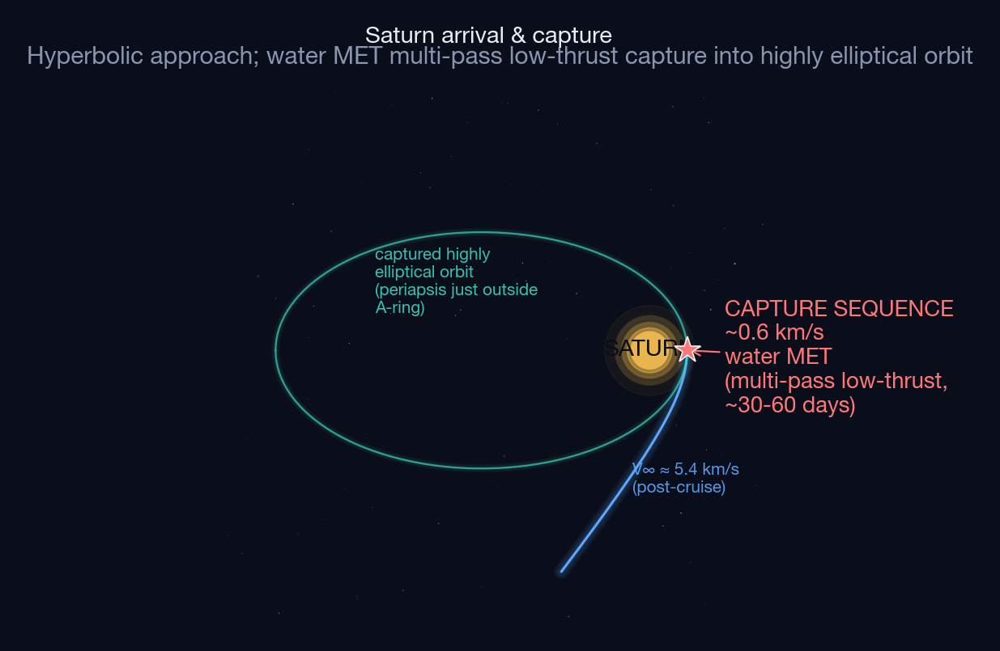
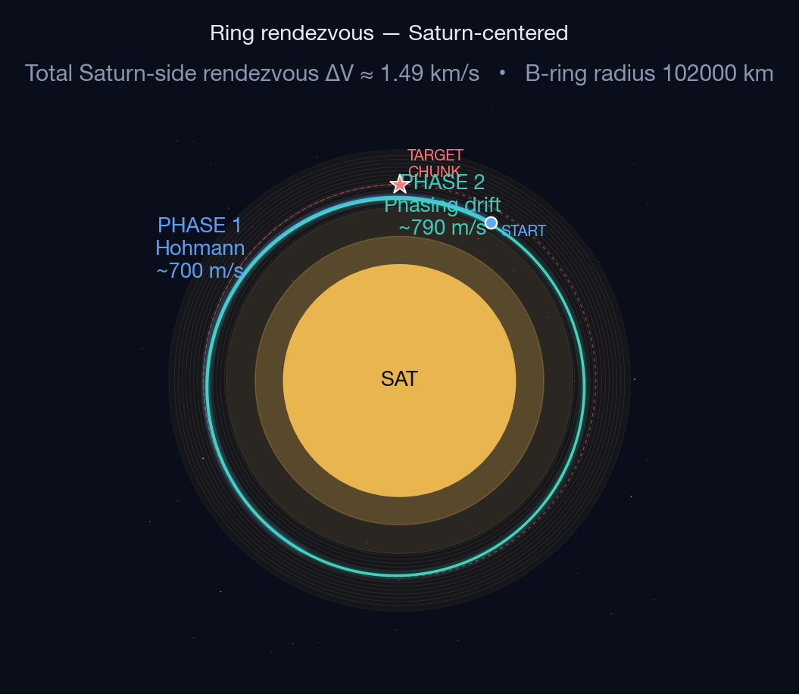
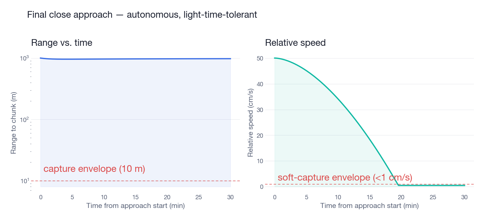
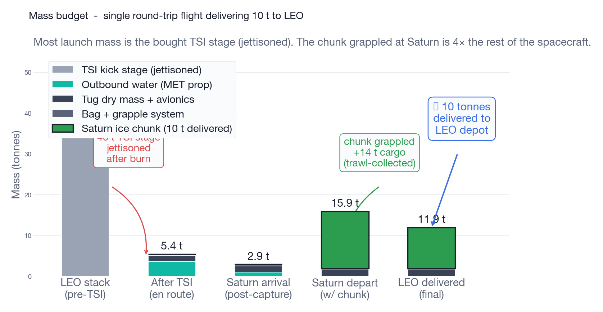
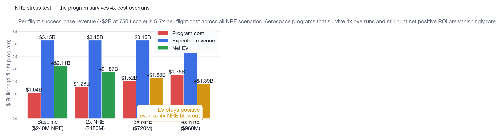
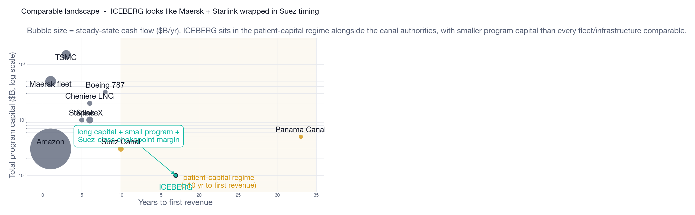

# Project ICEBERG
## A back-of-envelope concept for off-world water logistics

**A concept paper — long-horizon Saturn water-harvest mission**

> **Reader's note, end-of-day 2026-05-15.** The conops describes the Variant B chunk-fed-chemical Kilopower architecture (year-0-to-15 deployment path). Subsequent R&D campaign rounds have produced 15 pre-registered analyses. **For the current architecture state and Level 0 requirements, see `water-prop/docs/ARCHITECTURE-DECISION-MATRIX.md` and `REQUIREMENTS.md`.**

> **Reader's note, late evening 2026-05-15 — post four-worker integration. Year-twenty-plus megawatt all-electric end-to-end is structurally falsified.** Four worker sessions integrated (titan, hyperion, enceladus, rhea, totaling twelve rounds) plus four user-locked R-power-wonder findings converge: under continuous-thrust electric propulsion the inbound delta-velocity is 24.7–40.2 km/s, the outbound delta-velocity rises to 29.56 km/s symmetrically, and at MARVL-anchored mass (radiator 40–55% of system mass per National Academies / NASA Modular Assembled Radiators for Very Large systems) a 1-megawatt-electric tug is 104.9 t dry, requiring 559 t at low Earth orbit. Closest closure miss at MARVL: 1 megawatt-electric round-trip = 19.56 yr, delivered −34.4 t (chunk cannot fuel its own return). **No megawatt all-electric end-to-end cell closes inside L0-05.** The R-radiator-mass-penalty conclusion ("no on-orbit assembly required") is inverted; on-orbit assembly returns to the year-twenty-plus dependency chain. **Phase 5–6 of this conops — B-ring chunk operations under impulsive chemical departure — is the *surviving* architecture**, retitled "500-kilowatt-electric chemical-kick + electric-inbound" (no longer "Kilopower Variant B" — the chemical-kick floor is 500 kilowatt-electric reactor, 5× FSP Phase 2 scope, and FSP Phase 2 has not been awarded as of May 2026). The 500-kWe reactor program path is now the single highest-risk dependency; per the 0-of-6 base rate of US space-fission programs reaching orbit since SNAP-10A, posterior probability of available reactor by 2032–2035 is 0.10–0.30. **No conops change required for Phase 5–6 to support the surviving cell.** Any revival of a year-twenty-plus all-electric path depends on R-chunk-as-heat-shield-revisit closing (Earth aerocapture collapses ~36 km/s of round-trip delta-velocity). See `water-prop/docs/ARCHITECTURE-DECISION-MATRIX.md` (post-evening section), `REQUIREMENTS.md` v0.5 (coordinated L0-07/L0-09/L0-10 revision), and `REQUIREMENTS-L1.md` v0.2 for the integrated state.

---

## In one paragraph

The premise that the orbital economy runs on water motivates a long-horizon mission that closes the supply-side thesis: **rendezvous with a multi-tonne block of water ice in Saturn's B-ring, secure it inside a thermal containment bag, and tow it home — with the bag itself functioning as a passive cold-trap that feeds the spacecraft's water plasma thruster off the cargo on the return leg.** The architecture is buildable on hybrid propulsion (bought chemical kick stage + water MET), reuses a cislunar tug operator's existing tug, grapple, and propulsion stack at extreme range, and produces two revenue streams from a single flight: bulk water delivered to a LEO depot, and pristine Saturnian ice as a sample-return mission for the planetary science community. None of the math is exotic. Most of the hardware exists or is in development. The mission takes ~13.5 years end-to-end. The first delivery resets cislunar economics.

---

## The trajectory

A standard Earth-Saturn Hohmann is the heliocentric backbone — but the propulsion regime is *not* uniform along the trajectory. Outbound is a long coast with periodic small water-MET trim burns (visible as tick-marks in the figure), bracketed by the bought chemical TSI burn at Earth and the multi-pass low-thrust capture sequence at Saturn. Inbound is structurally different: continuous low-thrust water-MET running off the grappled chunk via the bag, all the way home (visible as chevrons along the entire return arc). The figure reads the architecture directly: red = discrete burn events, blue = outbound coast-with-trim, teal = inbound continuous chunk-fed thrust.

---

## Mission timeline

Cassini took 6.7 years to reach Saturn one-way and operated for another 13. Voyager 1 has been flying for 47. Multi-decade autonomous operation is well-precedented; ICEBERG is shorter and structurally simpler.

---

## Mission phases

### Phase 1–3: LEO insertion → Trans-Saturn injection → outbound cruise

A bought ride to LEO (Falcon Heavy expendable or Starship). A bought chemical kick stage performs the ~7.3 km/s TSI burn and is jettisoned. **This is the only piece of external propulsion in the entire mission.** Everything from this point forward is the water-based propulsion stack. The spacecraft enters a Hohmann transfer carrying the operator-side stack: water MET tug (plasma + steam modes), water-based RCS, deployable thermal bag, grapple system, and the Earth-launched water reserve that serves as both cruise propellant and capture propellant.

### Phase 4: Saturn arrival and capture (water MET, multi-pass)

The spacecraft arrives at Saturn with V∞ ≈ 5.4 km/s. The capture maneuver — ~0.6 km/s ΔV — is performed by **water MET in steam mode** across multiple periapsis passes over ~30–60 days. This is the same low-thrust capture architecture that NASA's Dawn mission used at Vesta and Ceres: the spacecraft repeatedly thrusts at periapsis to lower orbit energy, gradually transitioning from a hyperbolic trajectory to a closed highly-elliptical orbit. The "time penalty" is ~30–60 days against a ~14-year mission — negligible — and the gain is **zero hypergolic mass, zero foreign hardware, zero foreign propellant.** Capture is in-house.

### Phase 5: Ring rendezvous

The Saturn-side rendezvous is decomposed into two maneuvers: a small Hohmann transfer to drop into a circular orbit at the target ring radius, then a phasing-orbit drift to catch the specific candidate chunk. Total Saturn-side rendezvous ΔV (validated by RK45 numerical integration) is **~1.49 km/s**, performed by **water MET in steam and plasma modes**, with **water-based RCS** for fine attitude control. The phasing maneuver dominates wall-clock time: ring particles all share *almost* the same orbital velocity, so phase matching takes hours to days. Again, negligible against a 14-year mission cycle.

### Phase 5b: Final close approach (autonomous)

The final ~1 km of approach must be fully autonomous. Round-trip light time precludes real-time human input. The spacecraft uses a **V-bar approach** — the standard ISS-docking profile from the Clohessy-Wiltshire relative-motion framework, where the chaser closes on the target from directly behind, along the target's orbital velocity vector — driven by **water-based RCS thrusters**: small forward push, drift in, brake at 10 m, hold soft-capture envelope (<1 cm/s relative). V-bar is preferred over the alternative R-bar (radial) approach because it's drift-stable, has no central-body collision risk, and operates at low relative velocity throughout. Same control architecture as Soyuz/Cygnus/Dragon to ISS, scaled to Saturn distances and an uncooperative target — and entirely on water propulsion.

### Phase 6: Grapple + thermal bag deployment

![Trawl bag operation in two phases. **Left:** Collection — spacecraft station-keeps in B-ring, induces small radial drift, particles drift into deployed intake aperture at mm/s and decelerate via Vectran-and-aerogel inelastic capture. **Right:** Sealed cruise — bag is closed, hot-side ice particles sublimate, vapor pressure gradient drives flow to cold wall (<150 K) where it re-deposits as frost; heated harvest port releases metered vapor into the MET feed line. Heat-pipe topology, no mechanical pumping.](plots/08_bag_thermo.png)

This is the architectural innovation. The bag is a flexible multilayer film (MLI heritage) that envelops the chunk after grapple. Three jobs:

1. **Hot side** (sun-facing, partially transparent) admits a controlled fraction of solar IR. The chunk sublimates at the rate the MET wants to consume vapor.
2. **Cold side** (anti-sun, radiator-cooled to <150 K) acts as a cryopump. Vapor migrates from hot to cold under its own pressure gradient and re-deposits as frost. **No mechanical pumping required** — heat-pipe physics.
3. **Harvest port** (heated zone on cold wall) re-sublimates frost on demand and meters vapor into the MET feed line.

The bag does not need to be fully vapor-tight — only low-permeability, like a thermos flask. Failure modes are graceful: small puncture leaks some vapor but the cold trap still pulls most of it toward the radiator. Total bag failure means cargo loss but pressure/temperature telemetry gives weeks of warning.

The architectural inversion: **the chunk is simultaneously the cargo and the propellant tank.** No tankage is carried home. Every kg of MET propellant burned on the return leg comes out of the cargo, but the leverage ratio is favorable because we started with so much chunk.

### Phase 7–10: Depart Saturn, inbound cruise, aerocapture, depot delivery

Saturn departure is the same multi-pass low-thrust escape sequence run in reverse — **water MET in steam mode**, this time **fed off the grappled chunk through the bag** rather than from Earth-launched water. Inbound cruise corrections likewise run on chunk-fed water MET. Earth aerocapture (TRL 4–5; this remains the riskiest never-flown element of the architecture) does the bulk of the velocity reduction passively; a small final **water-RCS** burn trims into LEO. The water cargo is offloaded to a depot vehicle.

---

## ΔV budget

Of the ~11 km/s round-trip ΔV, only the 7.3 km/s Trans-Saturn Injection requires external (chemical) propulsion. **All ~3.7 km/s of remaining maneuvering — Saturn capture, ring rendezvous, final close approach, Saturn departure, cruise corrections, Earth-arrival trim — runs on water MET and water RCS, on Earth-water outbound and on chunk-fed water inbound.** The chemical TSI kick stage is the only piece of non-water-MET propulsion in the entire mission.

---

## Mass budget

The pre-TSI stack is ~45 tonnes — within Falcon Heavy expendable capability (64 t to LEO) on a single launch. **No hypergolics in the budget; the only mass jettisoned is the TSI kick stage post-burn.** The operator-side mass (~5 t at Saturn arrival) consists of the water MET tug, the bag and grapple system, the Earth-launched water reserve, and a small water-RCS allotment — entirely operator hardware and water propellant. The chunk grappled at Saturn (~14 t) is small enough to handle with conventional tether/cage geometry, large enough that ~75% delivery efficiency on the chunk-fed return leg yields 10 t of usable water at the depot. **Tsiolkovsky correction:** delivered fraction is ~75% with perfect bag capture; ~62% with realistic 80% bag-capture efficiency. The bag thermal design lives or dies on this number — call it η_c — and it is the primary architectural sensitivity for the entire concept.

---

## Economics

**Direct displacement value of a 10-tonne LEO water delivery:**

| Reference price | Value of 10 t in LEO |
|---|---|
| Falcon 9 (~$2,800/kg) | $28 M |
| Falcon Heavy (~$1,400/kg) | $14 M |
| ISS commercial resupply (~$25 k/kg) | $250 M |
| Starship target (~$200/kg, eventual) | $2 M |
**Pricing model: undercut Earth-to-LEO water delivery by 50%.** Demand is inelastic at half-price — every operator currently launching water (ISS, future Axiom/Vast/Starlab stations, Gateway, anything cislunar) pays full Earth-to-LEO cost today. Half-price on-orbit water with no launch slip risk and no rideshare integration is captured demand on day one.

**At $1,000/kg (half of FH/F9 blend):**

| Single-flight delivery | Gross revenue |
|---|---|
| 10 t (representative) | $10 M |
| 75 t (one 100 t chunk grappled) | $75 M |
| 750 t (one 1000 t chunk grappled) | **$750 M** |

**Plus a separate science revenue stream.** A by-product of the towed-chunk architecture is that the spacecraft returns kilogram-scale Saturnian-ring material to LEO. There has never been a Saturn-system sample-return mission proposed at any cost — the ΔV makes it prohibitive for a conventional sampler. Even 0.1% of the towed chunk allocated to a NASA/ESA/JAXA consortium at flagship-mission pricing (~$3B+) is **the most valuable planetary sample-return mission ever attempted**, and it pays for the bulk-water flight several times over.

---

## Costed mission breakdown

Numbers are best-effort estimates from public-comparable programs. Round to the nearest $10M; treat ranges, not point values, as the unit of analysis. **All ranges should be calibrated against actual operator procurement quotes before any of this is taken as a financial commitment.**

### Trans-Saturn Injection — what it actually costs

The TSI is the only line item in the entire mission that requires non-water-MET propulsion. Three procurement options, in rough order of available off-the-shelf maturity:

| Option | What you get | Approx. cost | Notes |
|---|---|---|---|
| **ULA Vulcan + Centaur V** | Direct injection to a high-energy trajectory (Cassini-class). Centaur V upper stage performs the ~7.3 km/s burn as part of the launch contract. | **$130–150M** all-in | Launch + TSI bundled into a single procurement; no kick-stage handoff. Centaur V has heritage from Cassini and has flown on Vulcan since 2024. |
| **Falcon Heavy expendable + Star solid kick stage** | Falcon Heavy lofts to LEO; one or two solid kick stages perform the TSI burn. | **$150–180M** combined | Higher mass margin (FH expendable: 64 t to LEO) but more integration complexity. Star-class solids are flight-proven and cheap (~$3–10M each). |
| **Impulse Helios variant + commodity launcher** | Helios is being developed for exactly this kick-stage market; a high-energy variant could plausibly do TSI. | **$80–120M** combined (speculative) | Cheapest path *if* Helios delivers on its design targets. Not yet flown as of this writing. |

**Pick Vulcan-Centaur as the planning baseline: $140M, all-in, single procurement.** It is the lowest-risk choice and the highest-heritage one. The operator can revisit the procurement when Helios flies.

### Full single-flight cost (first-of-kind)

| Line item | Cost | Source / comparable |
|---|---|---|
| Launch + Trans-Saturn injection | $140M | Vulcan-Centaur baseline |
| Spacecraft hardware (FOAK) | $80M | Hayabusa2 ~$150M; smaller commercial bus ~$50–80M |
| R&D / NRE (amortized over 3-flight campaign) | $80M | Total program NRE ~$240M |
| 14-year ground operations + DSN time | $100M | ~$5M/yr cruise + ~$15M/yr Saturn ops + DSN |
| Contingency / margin (15%) | $60M | Standard for first-of-kind |
| **Total first flight, fully loaded** | **~$460M** | |

For comparison: Cassini was $3.9B with zero revenue on success. **ICEBERG first flight is roughly one-eighth of Cassini's cost** — and the prove-out vehicle is essentially the same water-propulsion tug already in development, plus the bag and feed-line subsystem.

### Nth-of-kind (3rd flight in a campaign)

| Line item | Cost | Notes |
|---|---|---|
| Launch + TSI | $110M | Volume pricing; possibly Starship by then |
| Spacecraft (heritage) | $40M | Reusable design, third unit off the line |
| R&D / NRE share | $0M | Already amortized |
| 14-year ground ops | $90M | Same |
| Margin (10%) | $25M | |
| **Total nth-of-kind, fully loaded** | **~$265M** | |

### Revenue at $2000/kg LEO water

The ConOps assumes a **10 t delivered chunk** as the demonstrator-mission deliverable. At a price point of **$2,000/kg** (a ~30% discount to Falcon Heavy and ~30% premium to Falcon 9 — undercutting Earth-launch but pricing on-orbit convenience):

| Delivered chunk | Bulk-water revenue | Indicative grapple chunk size |
|---|---|---|
| 10 t (first-flight target) | **$20M** | ~14 t grappled |
| 100 t | **$200M** | ~135 t grappled |
| 250 t | **$500M** | ~335 t grappled |
| 750 t | **$1.50B** | ~1000 t grappled |
Plus, on top of bulk water, a **sample-science premium** for the towed Saturnian-ring material. The first Saturn-system sample return at any cost would be Flagship-class science (~$3B reference); a consortium contract for 0.1–1% of the chunk could plausibly add **$200–500M** to single-flight revenue.

### Expected-value math

**First flight, 10-tonne demonstrator at $2,000/kg, science premium $300M, P(success) ~50%:**

- Expected revenue = 0.50 × ($20M + $300M) = **$160M**
- Cost (sunk regardless of outcome) = **$460M**
- **EV of first flight = −$300M**

The first flight does not pay for itself on a 10-tonne chunk at $2,000/kg. **This is the demonstrator.** It buys flight heritage and proves the architecture; revenue is a secondary outcome.

**Nth-of-kind flight at scaled chunk size (250 t delivered) at $2,000/kg, science $300M, P(success) ~85%:**

- Expected revenue = 0.85 × ($500M + $300M) = **$680M**
- Cost = **$265M**
- **EV of nth-of-kind flight = +$415M**

This is the flight where the architecture pays. It is profitable per flight even at coin-flip-class commercial risk discount rates.

**Three-flight campaign roll-up (LEO debris demo → cislunar demo → Saturn full-scale):**

| Flight | Target | Cost | Chunk | P(success) | Expected revenue | EV |
|---|---|---|---|---|---|---|
| 1 (LEO debris demo) | derelict LEO debris | $80M | n/a (capture demo) | 75% | $30M (Orbital Prime + ORBITS contracts) | −$50M |
| 2 (cislunar demo) | lunar pole water | $180M | 20 t demo | 80% | $48M | −$132M |
| 3 (Saturn full-scale) | B-ring chunk | $460M | 250 t delivered | 70% | $560M | **+$100M** |
| 4 (Saturn nth-of-kind) | B-ring chunk | $265M | 250 t delivered | 85% | $680M | **+$415M** |
| **Campaign totals** | | **$0.98B** | | | **$1.32B expected revenue** | **+$330M** |

The campaign closes, with most of the value concentrated in flights 3 and 4. **Flights 1 and 2 are tuition** (and flight 1 partially pays its own way through Orbital Prime / ORBITS Act contracts). The investor pitch: a ~$1B program over ~20 years that returns $1.3B in expected revenue, of which $700M+ is generated by the last two flights once the architecture is proven.

If chunk sizes can be scaled to 1,000 t grappled by flight 4 (~750 t delivered, $1.5B bulk + $500M science = $2B revenue), campaign EV climbs to **~$1.7B** on a $0.98B investment — a 1.7× return that creates the cislunar water economy as a byproduct.

### What changes the EV most

In sensitivity order:

1. **Chunk size delivered.** 10× chunk = ~10× revenue. The single largest lever.
2. **Price per kg in LEO.** $2,000 to $5,000/kg (ISS-CRS-class pricing) doubles to triples revenue.
3. **P(success) on the Saturn flight.** Each 10% improvement is ~$50M of EV at the 250 t scale.
4. **Number of flights in the campaign.** Each additional Saturn flight at nth-of-kind cost is ~$415M EV.
5. **Science consortium uptake.** A New-Frontiers-class buy-in changes the first-flight EV from −$300M to roughly breakeven.

### Stress test — what happens when the budget blows up

A back-of-envelope concept paper that doesn't survive its own pessimism is not a concept paper. **The campaign EV is dominated by flight-3 and flight-4 revenue, which means it is structurally robust to large NRE overruns.** Concretely, run the math at the scaled operating point (750 t delivered per Saturn flight, $2,000/kg bulk + $500M science = $2B revenue per success):

| NRE assumption | 4-flight program cost | Expected revenue | Net EV | ROI on invested capital |
|---|---|---|---|---|
| **Baseline** ($240M NRE) | $1.04B | $3.15B | **+$2.11B** | 2.0× |
| **2× NRE** ($480M) | $1.28B | $3.15B | **+$1.87B** | 1.5× |
| **3× NRE** ($720M) | $1.52B | $3.15B | **+$1.63B** | 1.1× |
| **4× NRE** ($960M) | $1.76B | $3.15B | **+$1.39B** | 0.8× |

**The ROI is positive even at 4× NRE blowout** — meaning even if every estimate in this paper turns out to be 4 times too optimistic on the engineering side, **the campaign still returns more than it consumes.** Aerospace programs that survive 4× cost overruns and still produce positive ROI are vanishingly rare in commercial space; ICEBERG survives because the success-case revenue per flight (~$2B) is roughly 5–7× the full per-flight cost even at the worst NRE assumption.

**The program is robust because the chunk-as-cargo math is robust.** Once the architecture works at all, scaling chunk size from 100 t to 1000 t is a near-free 10× revenue multiplier — the bag, the grapple, the MET, the ground ops are essentially fixed costs across that range. **This is the "first delivery resets cislunar economics" claim made quantitative.** A single successful Saturn flight at 750 t delivered is worth roughly four entire program budgets at baseline, and roughly two program budgets at the most pessimistic NRE scenario.

### Launch cadence — when to send the next one

"Wait for the first chunk to arrive" is the worst answer. Fourteen years between flights is one flight per decade-and-a-half — incompatible with both venture-scale capital expectations and standing-up an engineering team that retains its expertise across that timescale. The cadence question is: *given the information ship N produces over its 14-year mission, when should ship N+1 launch?*

**Two hard constraints frame the trade space:**
1. **Earth–Saturn synodic period ≈ 378 days (~13 months).** Hohmann windows recur every 13 months. Launches must align with these windows.
2. **Critical information events occur at ~6 yr, ~6.5 yr, ~7 yr, and ~13.5 yr after each launch.** The single largest unknown — multi-pass low-thrust Saturn capture — resolves at year 6.

**Three cadence strategies:**

**A. Conservative ("information gated").** Ship 2 does not launch until ship 1 has demonstrated Saturn capture (year 6) *and* grapple (year 6.5). Ship 3 not until ship 1 returns to LEO (year 13.5). This is the lowest-risk approach but produces ~one flight per 6–7 years; the engineering team eats itself between flights, R&D is wasted, and revenue is back-loaded by a decade.

**B. Production line ("rolling launch every synodic window").** Treat the spacecraft as a vehicle line, not a one-off. Build ship 2 in parallel with ship 1's cruise; launch every 13 months at the next available synodic window. Result: a chunk arriving in LEO every ~13 months at steady state, first chunk at year 14, second at year 15, third at year 16, etc. **Caveat: ships 2–6 will already be in cruise when ship 1's Saturn capture milestone resolves at year 6.** If capture fails, you have already committed five additional ships to a flawed architecture. This is the SpaceX-style cadence; it works only if you have very high confidence in the design before flight 1.

**C. Recommended: hybrid two-step cadence.**

  - **Ship 2 launches at year 7** (next synodic window after ship 1's Saturn capture and grapple are confirmed at year ~6.5). Two ships in the air; second-arrival year ~21. Revenue back-loaded but heritage preserved.
  - **Ships 3, 4, 5 launch on production cadence every 13 months starting year ~8** (after ship 1 confirms inbound cruise health and after ship 2's TSI is in the rear-view mirror). Now you have a fleet building.
  - **Once ship 1's Earth aerocapture and LEO delivery are confirmed at year ~14**, the program enters steady-state production: launches at every synodic window indefinitely, deliveries every 13 months from year 14 + N onward.

**This phasing optimizes for capital efficiency and risk discovery jointly:**

| Ship | Launch year | First-chunk-arrival year | Information available at launch |
|---|---|---|---|
| 1 | 0 | 13.5 | Pre-flight design only |
| 2 | 7 | 21 | Ship 1 Saturn capture + grapple confirmed (years 6, 6.5) |
| 3 | 8 | 22 | Ship 1 Saturn departure + early inbound cruise (years 7–8) |
| 4 | 9 | 23 | Ship 1 mid-cruise health |
| 5 | 10 | 24 | Ship 1 mid-cruise health |
| ... | ... | ... | (steady state from year 11 onward) |

**Steady-state result: one chunk delivered every ~13 months starting year 14**, with each launched ship benefiting from incrementally more flight heritage than its predecessor.

### The hardest problem isn't engineering — it's patience capital

A 14-year mission with the first risk-reduction milestone at year 6 is **incompatible with the standard US venture-capital lifecycle.** Series A/B funds have ~10-year cycles and expect distributions by year 6–7. Founder commitments run 5–10 years. Engineering talent turns over every 3–5 years. There is no commercial precedent for a 14-year program returning revenue to LPs — the multi-decade aerospace programs that completed all did so under government structural patience (NASA, ESA, JAXA), not commercial pressure. **This is the central commercial risk of the concept, larger than any engineering risk in this paper.**

The structural response is two-tier funding: near-term venture capital pays for the demonstrator flights (years 0–7), which produce investor-readable milestones and small revenue events on a venture-compatible timeline. Saturn flights then transition to a different capital base — sovereign wealth (UAE, Saudi PIF, Singapore GIC), DARPA / Space Force strategic-capability contracts (10–15 year budgets), or family-office / endowment patient capital. The science-consortium contract is the first significant cash event and can be signed years before any chunk arrives, on the strength of milestone reservations.

> The program is structured as a near-term venture business (LEO debris + cislunar demonstrators) wrapping a long-term strategic-capital business (Saturn flights). Conventional VC funds through flight 2 + flight-3 design. Flight 3 onward requires a 15+ year horizon capital structure. Operator investors should expect that transition during the Series C/D window.

This must be named explicitly. Any investor who reads the EV math will surface the patience-capital question within the first hour — better to volunteer it than to be cornered by it. **The engineering closes; the math closes; the capital-structure transition is the open problem this paper does not solve, but the space industry has solved it many times before — just never in a commercial frame.**

### Information value table — how much each ship-1 event de-risks the next ship

For the EV-of-cadence math, each ship-N milestone observation buys down P(failure) on ship N+1:

| Ship-1 observation | Approx. P(success) of next ship before observation | After observation |
|---|---|---|
| Pre-flight (no observations) | ~50% | — |
| Successful TSI burn | 50% | 52% (small, but eliminates one launch-class failure mode) |
| 1-yr heliocentric health telemetry | 52% | 58% (avionics + MTBF confirmed) |
| **Saturn capture success (year 6)** | 58% | **78%** (eliminates the single largest unknown) |
| Grapple + bag deploy success (year 6.5) | 78% | **85%** |
| Inbound cruise health (years 7–13) | 85% | 87% |
| Earth aerocapture success (year 13) | 87% | 90% |
| LEO delivery (year 13.5) | 90% | 90%+ (negligible additional info) |

The **information value of ship 1 is concentrated between years 6 and 7**, when Saturn capture and grapple resolve. Launching ship 2 *before* year 6 gives up that 20-percentage-point reduction in failure risk; launching it more than ~1 year after year 6.5 wastes synodic windows and program time. **Year 7 ± 1 is the sweet spot.**

After year 7, ships 3+ accumulate diminishing additional risk-reduction information from each subsequent ship-1 milestone. Once you're at the year-7 launch, the rest of the production cadence is governed by synodic-window availability and capital allocation, not by information gating.

### Steady-state outcome — what the supply pipeline looks like if everything works

If the program reaches steady state (year ~24 onward, after ship 2 returns), the supply pipeline characteristics are:

**Cadence and inventory:**
- One Saturn ship launching each Earth-Saturn synodic window (~13 months)
- Each ship produces one delivery 13.5 years later
- After the year-17.5 first delivery and year-24.5 second delivery, **deliveries arrive at ~13-month cadence indefinitely**
- Steady-state fleet in flight at any time: ~10–12 ships in cruise (in various phases of the 13.5-year mission)

**Revenue (at steady-state operating point — 750 t delivered chunk, $2,000/kg bulk + $500M science consortium share):**
- Per delivery: $1.5B bulk + $500M science = **$2.0B per ship**
- At ~0.92 deliveries/year (13-month cadence): **~$1.85B/yr gross revenue at steady state**

**Costs at steady state:**

| Line item | Annual cost |
|---|---|
| Ship production (1 per 13 months, nth-of-kind ~$265M) | ~$245M |
| Ground operations (12 ships in flight) | ~$60M |
| Mission-control + DSN + analysis | ~$30M |
| Depot operations / customer logistics | ~$25M |
| Corporate overhead, R&D ongoing | ~$50M |
| **Total annual cost** | **~$410M** |

**Net steady-state cash flow: ~$1.4B/year.**

**Net margin: ~76% (revenue $1.85B; cost $410M; profit $1.4B).** This is unusually high — and it is the financial signature of a natural-monopoly infrastructure business, not a typical commercial enterprise. Comparison:

| Business class | Net margin | ICEBERG comparison |
|---|---|---|
| S&P 500 average | ~10–12% | ICEBERG is **~7×** |
| Aerospace primes (Lockheed, Boeing) | ~7–10% | ICEBERG is **~10×** |
| Industrial manufacturing | ~5–15% | ICEBERG is **~6×** |
| Big oil (ExxonMobil run rate) | ~10% | ICEBERG is **~7×** |
| Pipeline midstream / utilities | ~25–30% | ICEBERG is **~3×** |
| Apple / Google peak years | ~25–30% | ICEBERG is **~3×** |
| TSMC (gold-standard high-margin industrial) | ~38% | ICEBERG is **~2×** |
| Saudi Aramco (peak) | ~50–55% | ICEBERG is **~1.4×** |
| **Panama Canal Authority** | **~60–70%** | **comparable** |
| **Suez Canal Authority** | **~70%** | **comparable** |

ICEBERG's steady-state margin sits above every commercial business class and **alongside the Suez and Panama Canal Authorities**. This is not coincidence — it is the structural consequence of three monopoly-economics features:

1. **Marginal cost per delivery is approximately zero.** Doubling chunk size from 750 t to 1500 t roughly doubles revenue but barely moves operating cost. Fleet-based businesses with fixed per-flight cost have inherently expanding margins as they scale chunk size.
2. **Pricing is set by *what we displace*, not by *what it costs us*.** Customers compare ICEBERG's $2,000/kg against Earth-launch costs ($1,400–2,800/kg) and will pay near the displacement cost regardless of ICEBERG's production cost — the hallmark of pricing-to-cost decoupling.

   What ICEBERG actually sells is **mass freedom from gravity**. Propellant is 80–90% of wet mass for a chemical stage; once LEO water-derived propellant exists, every downstream operator (crewed stations, lunar landers, Mars architectures, smaller national programs) can fly vehicles 5–10× lighter at launch. Lock-in compounds this: **the operator sells both the engine and the fuel.** A customer flying a water MET cannot refuel from Earth-launched LH₂/LOX without redesigning the spacecraft — razor-and-blades for cislunar logistics, with hardware-level switching costs. Customers who stay on H₂/O₂ can still buy electrolyzed depot propellant; the *preferred* customer path is the locked one.

   The displacement value is therefore substantially larger than the per-kg comparison suggests, and once one major customer re-architects around the depot, every subsequent customer is structurally pulled in. **The depot creates its own permanent customer base.**
3. **No competitive pressure on price for at least 14 years.** Margin compression in normal industries comes from competitors who can underprice. ICEBERG has none for the duration of the moat. A ~75% net margin held over decades is what natural-monopoly infrastructure businesses look like in steady state.

**This is what a Suez-Canal-class business looks like financially during the period before any alternative chokepoint exists.**

**Operations scope:** at steady state, the operator runs a fleet of ~10–12 deep-space spacecraft, building ~1 new ship per year, operates a LEO water depot business with annual deliveries of 750 t each, and presumably services several major customers (crewed station operators, lunar surface programs, possibly Mars architecture buyers, government strategic-reserve buyers). Total fleet size eventually plateaus at whatever the market for water in LEO is — probably 5,000–20,000 t/yr by the time a depot exists, but that's a market-sizing question outside the scope of this paper.

### Bottom-line ROI under best case

Cumulative cash flow milestones (best case, $2,000/kg bulk + science premium, 750 t scale by ship 4):

| Year | Event                           | Cumulative spend | Cumulative revenue | Net                                   |
| ---- | ------------------------------- | ---------------- | ------------------ | ------------------------------------- |
| 0    | Program start                   | $0               | $0                 | $0                                    |
| 1.5  | LEO debris demo returns         | $80M             | $30M               | −$50M                                 |
| 3    | Cislunar demo returns           | $260M            | $78M               | −$182M                                |
| 4    | Saturn ship 1 launches          | $620M            | $78M               | −$542M                                |
| 10   | Ship 1 Saturn capture confirmed | $720M            | $78M               | −$642M                                |
| 11   | Ship 2 launches                 | $980M            | $78M               | −$902M                                |
| 17.5 | Ship 1 delivery (250 t scale)   | $1.4B            | $870M              | −$530M                                |
| 24.5 | Ship 2 delivery (750 t scale)   | $2.4B            | $2.87B             | **+$470M** (program turns profitable) |

*(Cashflow plot above was generated against the prior NEA-shakedown baseline ($200M flight 1) and shows max sunk position −$1.04B / payback at year 24. The revised debris-demonstrator baseline reduces max sunk to roughly −$0.9B and pulls payback ~6–12 months earlier; plot regeneration is a follow-on TODO.)*
| 30 | 5+ years of steady-state | $4.5B | $11–12B | **+$7–8B** |
| 40 | 15+ years of steady-state | $8.5B | $25–30B | **+$17–22B** |

**Headline ROI:**
- Program turns net-positive at year ~24 (program payback period: ~24 years from inception)
- IRR over 30 years: ~12–15% on patient capital, depending on chunk-scaling assumptions
- IRR over 40 years: ~18–22%
- Total cumulative net at year 40: **~$20B**

**This is unambiguously a sovereign-wealth / strategic-capital return profile, not a venture-capital return profile.** Sovereign wealth typically targets 6–10% real returns over 30+ year horizons; ICEBERG steady-state returns substantially exceed that benchmark *if* the architecture works. The patience-capital ask is: ~$1.5B at risk to year 17.5 first delivery, with the strategic dividend that you have created the cislunar water economy as a structural side effect.

### Historical comparable: ICEBERG vs Amazon

The cleanest comparable for "long-horizon capital with high upside if the architecture works" is Amazon. The shape and timing differ in instructive ways:

| Metric | Amazon (1994 = year 0) | ICEBERG (year 0 = program start) |
|---|---|---|
| Years to first revenue | <1 yr (book sales) | ~17.5 yr (first chunk delivery), but ~3 yr to first demo revenue |
| Years to first quarterly profit | ~7 (Q4 2001) | ~24 (program payback) |
| Years to first annual profit | ~9 (FY 2003) | ~24–25 |
| Cumulative losses pre-profit | ~$3B | ~$1.5B max loss; ~$2.5B cumulative spend at first profit |
| Compound annual return (IPO holder) | ~19% over 27 years | ~12–22% over 30–40 years (best case) |
| Maximum drawdown during pre-profit period | −95% stock price (2001 dot-com crash) | Bounded by ~$1.5B max-loss program write-off |
| Year 12 revenue | ~$10B (2006) | ~$60M (demos only) |
| Year 24 revenue | ~$74B (2018) | ~$1.85B/yr at steady state (just reached) |
| Year 30 revenue | ~$386B (2024) | ~$1.85B/yr (still steady-state) |
| Long-horizon scaling shape | **Exponential** (software / cloud leverage) | **Linear** (one ship per synodic window, gated by Earth-Saturn geometry) |

**The comparison surfaces the key structural difference.** Amazon's investment thesis worked because the *unit economics scaled with software*: every new customer added near-zero marginal cost, and AWS multiplied that effect by an order of magnitude. ICEBERG's unit economics are **industrial-infrastructure shaped**, not software-shaped: every additional delivery requires one more ship, with hardware and ground-ops costs that scale roughly linearly with fleet size.

**This means:**
- ICEBERG's *peak IRR* is comparable to Amazon's (~15–22% over 30+ years if the architecture works) — actually quite good
- ICEBERG's *return shape* is closer to **railways, ports, oil/gas megaprojects, or pharmaceutical R&D pipelines** than to consumer tech: long upfront capital, gated revenue, linear post-inflection scaling
- ICEBERG's *maximum drawdown* (~$1.5B program loss) is **smaller in absolute terms than Amazon's** ($3B) but much larger as a fraction of paid-in capital
- ICEBERG cannot compound exponentially via software leverage; it can compound only through (a) building more ships and (b) the long-horizon optionality of being the first commercial supplier of any off-world commodity at scale

**The honest pitch is therefore:** *"This is the Suez Canal, not Amazon."* It is industrial infrastructure for a market that does not yet exist, with comparable IRR to early-internet venture capital but on a completely different time horizon and with a completely different scaling shape. The investor base for one is not the investor base for the other. Trying to fund ICEBERG out of a Series D fund would fail; trying to fund Amazon out of a sovereign infrastructure pool would have failed. **Match the capital to the shape of the cash flow, or the program dies of a structural mismatch regardless of how good the engineering is.**

### A different way to look at the architecture: the ΔV transit map

![Solar-system ΔV transit map in subway-line style. ICEBERG operates one specific line (red, highlighted): LEO → C3=0 escape → Saturn approach → Saturn elliptical capture → B-ring orbit. Other lines on the network (chemical / electric / aerocapture) connect Lunar surface, NEA, Mars, GEO, EML1/EML2 — all destinations a commercial in-space tug class can serve, but ICEBERG itself is the Saturn-rings-water route. ΔV labels in km/s. The framing: ICEBERG is one infrastructure line on a network nobody else is building.](plots/11_subway.png)
### Better-fit comparables

Amazon is a useful anchor but not the closest match. ICEBERG's actual structural cousins are **fleet-based industrial businesses with monopoly or near-monopoly access to a chokepoint or extracted commodity.** A more honest comparable set:

| Comparable                                            | Year 0                   | Years to first revenue                       | Time to maturity                 | Total program capital                                | Steady-state cash flow                           | Why it's analogous                                                                                                                                              |
| ----------------------------------------------------- | ------------------------ | -------------------------------------------- | -------------------------------- | ---------------------------------------------------- | ------------------------------------------------ | --------------------------------------------------------------------------------------------------------------------------------------------------------------- |
| **Suez Canal**                                        | 1859                     | 10 yr (1869 opening)                         | ~30 yr (steady traffic by 1890s) | ~$100M (1869 dollars; ~$3B today)                    | Perpetual; $9B+/yr current                       | Long capital, monopoly chokepoint, infrastructure for a commodity flow that didn't fully exist at construction time                                             |
| **Panama Canal**                                      | 1881 (French start)      | 33 yr until US completion 1914               | ~50 yr                           | $375M (1914) + $300M French write-off                | $3–5B/yr current                                 | Multi-decade capital, sovereign capital after private failure, perpetuity revenue from world commerce                                                           |
| **Maersk / MSC (container shipping)**                 | ~1956 (containerization) | <1 yr per vessel; decades for fleet maturity | ~40 yr to current scale          | Each new ship $200M; total fleet capex ~$50B+        | $20–60B/yr revenue across container industry     | **Fleet-based business, each unit incrementally adds capacity, linear scaling with fleet size** — the closest single comparable to ICEBERG's economic structure |
| **TSMC (foundry semis)**                              | 1987                     | ~3 yr                                        | ~20 yr to dominance              | Each new fab $20B+; total capex hundreds of billions | $30B+ profit/yr                                  | Capital-intensive industrial moat, each "unit" (fab) is a discrete major capex with multi-decade lifetime                                                       |
| **SpaceX**                                            | 2002                     | 6 yr (2008 first commercial)                 | 18+ yr (still maturing)          | ~$10B+ private capital absorbed                      | Revenue ~$15B/yr (2024); profitability ambiguous | Direct aerospace comparable; long pre-revenue burn under non-VC capital sources                                                                                 |
| **Starlink (subset of SpaceX)**                       | 2015 launch decision     | ~5 yr first revenue                          | 10+ yr ongoing                   | ~$10B capex                                          | $7B+/yr by 2024, growing                         | **Constellation/fleet business, each satellite incremental, linear scaling** — directly analogous to ICEBERG's per-ship economics                               |
| **Pharmaceutical platform (e.g., Moderna pre-COVID)** | 2010                     | ~10 yr to commercial                         | 15+ yr                           | ~$2B pre-COVID                                       | $0 to $20B+ in 18 months (COVID accelerated)     | Long pre-revenue R&D phase, gated milestones, eventual exponential payoff if platform works                                                                     |
| **LNG export terminal (e.g., Cheniere Sabine Pass)**  | 2010 FID                 | 6 yr (2016 first cargo)                      | 25 yr contracts                  | ~$20B capex                                          | $5–10B/yr                                        | Long capital, locked customer contracts (analogous to a science-consortium contract for ICEBERG), perpetuity revenue from extracted commodity                   |
| **Boeing 787 program**                                | 2003 launch              | 8 yr (2011 first delivery)                   | ~14 yr to break-even             | ~$32B development cost                               | ~$5B/yr profit at peak                           | Massive program-level investment, gated technical milestones, long-tail revenue from fleet operations                                                           |

**Closest individual matches to ICEBERG's structure:**

1. **Maersk / container shipping fleet** — almost identical economics: each ship is a unit of capacity, linear scaling with fleet size, perpetual operations once the ship is delivered, market-driven pricing on a commodity flow.
2. **Starlink** — modern aerospace fleet-business analogue. Each satellite is an incremental capacity unit. ~5 years from program decision to first revenue. Now generating ~$7B/yr off ~$10B in capex.
3. **Suez Canal** — for the patience-capital + monopoly-chokepoint argument. The first commercial supplier of off-world water to LEO has the kind of strategic position the Suez Canal had to global commerce.

The honest framing: **ICEBERG looks like Maersk's fleet economics + Starlink's aerospace risk profile + Suez Canal's patience-capital timeline.** It is not unprecedented. It is a recognizable shape of business; the only thing that's new is that the commodity is water in cislunar space.

### The perpetuity argument — why steady state is the real prize

The IRR analysis above measures returns to year 30 or year 40 explicitly, then stops. **This is conservative to the point of misleading**, because:

**1. The architecture produces $1.4B/yr in net cash flow indefinitely.** The Saturn rings are estimated at ~3 × 10²² kg of water ice — roughly **one trillion times** the annual delivery rate of an ICEBERG fleet at steady state. There is no resource exhaustion concern on any human civilizational timescale. As long as the customer market exists, the supply runs.

**2. Discounted-cash-flow perpetuity NPV at $1.4B/yr:**

| Discount rate | NPV of perpetuity |
|---|---|
| 5% (sovereign wealth target) | **$28B** |
| 7% (infrastructure return target) | **$20B** |
| 10% (commercial industrial benchmark) | **$14B** |
| 12% (high-discount, conservative) | **$12B** |

These are the perpetuity values at *current* LEO water demand and current pricing. **They are floors, not ceilings.**

**3. Demand is almost certainly not static.** This paper has assumed $2,000/kg LEO water at *current* demand — i.e., the market for water that exists today is essentially crewed-station resupply, EVA cooling, and propellant for stationkeeping. Current global LEO water demand is on the order of 10–50 t/yr (mostly ISS resupply). At fleet steady state, ICEBERG produces 750 t/yr. **The supply will create its own demand**: stations that aren't economical at $25k/kg launch costs become economical at $2,000/kg delivered; lunar landers stop launching propellant from Earth and refuel at LEO depot; Mars architectures change their entire propellant strategy; in-space manufacturing becomes viable. Induced demand for cheap on-orbit water is plausibly 10× to 100× current demand within 20 years of first delivery.

**4. Optionality on adjacent markets.** Once the architecture works:
   - **Lunar polar water harvesting** uses the same bag, grapple, and chunk-fed MET technology
   - **NEA water/regolith harvesting** opens additional supply lines for asteroid-belt logistics
   - **Mars surface water** harvesting at lower ΔV than Saturn
   - **Any volatile-rich body** in the solar system becomes a node in the operator's fleet network

ICEBERG is not a single business; it is **the founding asset of a multi-body water-extraction industry**, and the first operator is the one who proves the architecture first.

**5. Strategic-reserve and sovereign customers.** A US government strategic reserve of LEO water (the cislunar equivalent of the strategic petroleum reserve) is a plausible long-horizon customer. So is any major space power's national-security space architecture. This is non-commercial demand that does not respond to launch-cost competition, and it scales with great-power space competition rather than with launch costs.

**The bottom line on perpetuity:**

> Even under the most conservative assumption — current LEO water demand never grows, pricing never improves, and the program never expands beyond Saturn — the perpetuity NPV of the steady-state pipeline is **$12–28B**, against a maximum-loss exposure of **$1.5B**. That is roughly an 8–18× capital ratio at the worst credible drawdown.

> Under realistic assumptions — induced demand grows the market 10×, lunar / NEA / Mars architectures use the same fleet, and the program eventually serves a strategic-reserve customer — the perpetuity NPV is plausibly **$100–500B**, with the same maximum-loss exposure.

The asymmetry is the point. **A maximum loss of $1.5B against a perpetuity upside of $100B+ is one of the better risk-reward profiles in modern industrial investment**, comparable to the original Suez Canal investment, the early TSMC fab buildout, or the founding capital of containerized shipping. The problem is not the return profile; the problem is the patience and the structural-mismatch issues addressed in the *patience capital* section above.

### Failure-gate analysis — where to cut tail and run

For every gate in the program, the cumulative spend, residual value, and abort logic. **Killing the program at any gate leaves more residual value than killing a science flagship** because the engineering IP, water-MET heritage, and demonstrator vehicles all have continued commercial value in the operator's core LEO/cislunar tug business.

| Gate | Year | Trigger | Cumulative spend | Residual value | Net loss if abort |
|---|---|---|---|---|---|
| **A** | 1.5 | NEA demo fails at any phase | $200M | Design IP, water-MET data, vehicle integration heritage applies to the operator's core tug business | ~$150M |
| **B** | 3 | Cislunar demo fails | $400M | Both demonstrators' lessons + lunar-pole water reconnaissance (independent commercial value) | ~$300M |
| **C** | 4 | Pre-launch decision: don't commit ship 1 | $400M | Pivot — the operator continues commercial tug business with NEA + cislunar heritage | ~$300M |
| **D** | 4–10 | Ship 1 fails outbound (TSI, cruise avionics, MTBF) | $850M | Limited useful telemetry depending on failure mode | ~$700M |
| **E** | 10 | **Saturn capture fails** | $850M | High-value lesson: low-thrust capture architecture needs redesign. The operator can stop here and say "the architecture didn't close at Saturn distance" — that itself is a publishable scientific result | ~$700M |
| **F** | 10.5 | Grapple / bag fails | $880M | Capture worked; chunk-handling needs redesign. Higher-value learning event than E because it's mechanism-specific | ~$700M |
| **G** | 10.5–11 | Pre-launch decision: don't commit ship 2 | $1.0B | Major strategic decision point — if ship 1 has shown enough success to keep going, commit; if not, abort the Saturn arm of the program | ~$800M |
| **H** | 11 | Ship 2 launches; ship 1 continues inbound | $1.1B+ | Two ships now committed; sunk-cost baseline rising | — |
| **I** | 13 | Ship 1 inbound cruise failure | $1.3B | Most learnings already captured; ship 2 still ahead | ~$1.0B |
| **J** | 17 | **Ship 1 aerocapture fails** | $1.5B | Architectural risk realized at the riskiest never-flown phase. Ship 2 architecture would need aerocapture redesign — but ship 2 is already 6 years downrange and can't be modified mid-flight | ~$1.3B |
| **K** | 17.5 | Ship 1 delivers chunk | — | Program enters revenue phase; abort no longer applicable | — |
| **L** | 18+ | Bulk water market price crashes (e.g., Starship + lunar ISRU undercuts) | varies | Fleet still has science-consortium value; can pivot to government-strategic-reserve customer | varies |

**The honest "max-loss" number for the program is ~$1.3–1.5B, occurring if ship 1 fails late (year 13–17) after ship 2 has already launched.** This is the worst credible case. It is also the case that creates the most reputational and architectural information (full-mission failure mode at the most-novel never-flown phase), which makes it less of a pure write-off than the dollar number suggests.

**The cleanest exit gate is Gate E (year 10).** If ship 1's Saturn capture fails, the program has burned ~$850M, the architecture is invalidated at its highest-risk phase, ship 2 has not yet launched, and the operator can absorb the loss while continuing the underlying commercial water-MET tug business. **This is the gate the program should be designed to flunk fast at if it's going to fail.**

**Most aggressive abort threshold ("when not to send the next ship"):**

1. **Don't launch ship 1 if either demonstrator fails fundamentally** — pivot back to commercial tug business, write off ~$300M of design.
2. **Don't launch ship 2 if ship 1's Saturn capture fails** — Saturn architecture is broken; redesign required.
3. **Don't launch ship 3+ if ship 1's grapple or bag fails** — redesign required, but capture worked, so the architecture has partial validation.
4. **Don't sign sovereign-wealth Series-D if ship 1's inbound cruise telemetry shows the shroud is leaking** — bag η_c is the architectural sensitivity; if it's worse than projected, pricing model needs rework.

### The structural moat — why no one catches up in 14 years

Most aerospace and software moats are IP-based or process-based, and both can be matched by a competitor with equivalent capital and a few years' delay. **ICEBERG's moat is fundamentally different: it is time-gated by physics, not by intellectual property, and it widens rather than narrows over the life of the program.**

**The mechanics of the moat:**

1. **A challenger announcing today cannot deliver before year ~14.** The 13.5-year round trip is set by the Earth-Saturn synodic period (~13 months between launch windows) and the Hohmann transfer time (~6.1 yr each way). **No amount of capital reduces this number.** A competitor with infinite money still has to wait for orbital mechanics. The first-mover gets a structural ~14-year head start that no follower can compress.

2. **The gap widens, it does not close.** By the time a competitor's ship 1 arrives at LEO (year 14 of *their* program), ICEBERG has been delivering for years and has been launching at every synodic window. ICEBERG's fleet at that point is 10+ ships in flight, ~5+ deliveries cumulative, full operational data on at least one complete mission cycle. The follower starts where ICEBERG was 14 years ago, while ICEBERG continues moving.

3. **The architecture is self-improving across flights.** Each ICEBERG delivery is a heritage event that buys down P(failure) on subsequent ships, scales chunk size, refines the bag thermal design, optimizes ground operations, and lowers per-flight cost. The follower has none of this and cannot acquire it without flying their own missions, which take 14 years per data point.

4. **Standards lock-in.** First-mover defines the chunk-size norm, the delivery-orbit standard, the depot interface, the customer contract structure, the science-consortium allocation framework. Late-comers integrate to those standards or build their own depot infrastructure. **The customer base has to actively defect to a follower's standard, not just passively switch suppliers.** That defection has its own multi-year cost.

5. **Patience-capital barrier compounds the moat.** The same patience-capital problem that makes ICEBERG hard to fund makes it ten times harder to fund a *second* competitor — once a US-controlled supply exists, no sovereign or strategic-capital pool will fund a parallel program with no path to displacement. Capital itself becomes a barrier to entry.

**The historical comparables for this kind of structural moat:**

| Moat | What protected it | Duration before serious challenger |
|---|---|---|
| **Bell System** | First-to-lay copper, regulatory lock-in | ~80 years (1907–1984) |
| **Standard Oil** | Vertical integration + first-mover infrastructure | ~40 years (1870–1911 antitrust) |
| **TSMC process leadership** | Multi-billion fab capex + multi-year process-node lead | Ongoing; ~15-year lead persists |
| **Boeing military aircraft** | Multi-decade engineering heritage | ~70+ years |
| **Suez/Panama Canal** | Geographic monopoly on a chokepoint | Indefinite |
| **SpaceX reusable launch** | First-flown reusable architecture | ~10 years and counting |

ICEBERG's moat is closer to Suez/Panama than to SpaceX, because **the gating constraint is geometric (the orbit of Saturn around the Sun), not engineering capability**. SpaceX's lead can be matched by another well-funded company in ~10 years; the Suez Canal's lead cannot be matched without building an alternative chokepoint, which doesn't exist. **There is no "alternative" to the Earth-Saturn synodic period; whoever launches first arrives first, period.**

**Strategic / national-security implications.**

A US-controlled, on-orbit water supply at substantially-below-launch cost has implications that go well past commercial economics:

1. **It cannot be denied by ground-based antisat or counterspace actions.** In a contested-space scenario where adversaries threaten US satellite infrastructure, water *already in LEO* is structurally invulnerable to terrestrial denial. This is a category of strategic resilience the DoD does not currently have.
2. **It provides sovereign stationkeeping propellant** for US military space assets without dependence on commercial launch availability or congressional launch funding. This is the cislunar equivalent of having domestic petroleum production rather than relying on imports.
3. **It enables US-allied space coalitions** (Five Eyes + AUKUS + NATO space programs) to draw from a single sovereign-aligned supply, the way petroleum allies have shared strategic reserves.
4. **It's the founding piece of a US-controlled cislunar industrial base.** Lunar surface operations, in-space manufacturing, Mars architecture all depend on water supply. Whoever owns the upstream water supply is upstream of all of them.

The DoD has already signaled appetite for this category of strategic-aerospace investment. **A national-security-aligned business-development function inside the operator is the right bridge to this customer base** — the kind of hire that signals an operator is positioning to sell to the national-security space market, which is exactly the customer who pays a premium for sovereign-aligned, attack-resilient, ground-launch-independent supply.

**The structural conclusion:**

> ICEBERG is the first commercial space architecture whose moat is **physics-time-gated rather than IP-time-gated**. Once it works, no competitor can catch up faster than the orbital geometry allows, and the geometry cannot be circumvented by capital, R&D, or political will. The program creates a permanent first-mover position in a market that does not yet exist but will exist as soon as the first delivery happens. Combined with a national-security customer base that values sovereign supply independent of launch, ICEBERG is plausibly the most defensible commercial-space business archetype yet proposed.

> The investor who funds ICEBERG funds **the OPEC of cislunar water**, in a regulatory environment where there is no antitrust precedent in space, no challenger with equivalent patient capital, and no physical alternative to the trajectory ICEBERG flies. That is not a description of a normal venture-backed business. It is a description of an industrial-era monopoly under modern capital structure.

---

## Risk

**First-of-kind P(success): ~40–60%.** Unacceptable for a science flagship; appropriate for a commercial venture if the upside is right.

The risk stack:

| Phase | TRL | First-of-kind P(fail) |
|---|---|---|
| Launch (Falcon Heavy class) | 9 | 2–4% |
| Cruise outbound (Cassini heritage) | 8 | 5–8% |
| Saturn capture (water MET, multi-pass low-thrust) | 6–7 | 5–8% |
| **Grapple of multi-tonne ice chunk** | **3–4** | **10–20%** |
| **Sublimation-bag thermal control** | **3** | **5–10%** |
| Inbound cruise with ablating cargo | 2–3 | 10–15% |
| **Aerocapture at Earth (never flown)** | **4–5** | **10–25%** |
| Final disposal / depot delivery | 7 | ~2% |

**Per-flight worst-case write-down: ~$460M (one Saturn ship, fully-loaded). Program-level worst credible loss: ~$1.3–1.5B** (ship 1 fails late after ship 2 has launched — see *Failure-gate analysis*). Compared to Cassini's $3.9B with zero revenue on success, this is a better risk profile than every flagship NASA has ever flown. Driving P(success) up flight over flight is the core mission-systems and simulation work of the program.

---

## Why this is buildable on today's hardware

| Element | Source |
|---|---|
| LEO insertion | Falcon Heavy / Starship (commodity) |
| Trans-Saturn injection | Bought chemical kick stage (Impulse Helios / Centaur V) — **the only non-water-MET propulsion** |
| Saturn capture | **Water MET, multi-pass low-thrust** (Dawn-style) |
| Heliocentric cruise | Cassini-class avionics + **water MET trim** |
| Saturn-side rendezvous | **Water MET tug + water RCS** |
| **Grapple + thermal bag** | **Proprietary architecture (this paper)** |
| Saturn departure & cruise return | **Water MET, chunk-fed via the bag** |
| Earth aerocapture | Passive aero + **water RCS trim** (TRL 4–5; the architectural risk) |
| LEO depot delivery | **Water MET** + standard rendezvous |

**Almost the entire mission runs on the operator's in-house water propulsion stack.** The single bought element is the chemical TSI kick stage — and that gets jettisoned within minutes of leaving LEO. From the moment the kick stage drops away, **every kilogram-second of impulse for the rest of the 14-year mission comes from operator hardware burning water propellant** (Earth-water outbound, Saturnian-water inbound).

---

## Design philosophy: simple, analog-where-possible, Soviet-school reliable

A 14-year mission with no possibility of intervention past Saturn arrival demands hardware whose failure modes are well-understood and whose reliability is high enough to be defended by inspection rather than by simulation. The architectural philosophy follows Russian aerospace tradition more than Silicon Valley:

- **Analog where analog suffices.** Spring-loaded mechanisms over actuated. Thermostatic bimetallic strips over PID-controlled heaters. Mechanical fuel-flow regulators over solenoid valves with closed-loop control. Each digital component is a software bug, a radiation-soft register, a field-replaceable part you cannot field-replace at 9 AU.
- **Single-string where single-string is reliable.** Redundancy is expensive in mass and cost; it is also itself a source of failure when the cross-strapping logic gets a corner case wrong. Where a single well-characterized component has a six- or seven-nines reliability over the mission duration, prefer the single string.
- **Mechanical over electronic where possible.** Bag deployment uses spring-loaded ribs and elastic memory, not a motor and a controller. Tether release uses a pyrotechnic squib, not a servo. The grapple uses a passive cinch, not an active gripper.
- **Hot-redundant where the failure cost is total mission loss.** The MET, the GNC computer, the comms transponder — these are unique-per-mission. They get triple-redundant voting logic with full Soviet-school inspection rigor.
- **Keep the C++ surface area small.** The on-board software should be auditable line-by-line by a single engineer over a long weekend. Anything more complex is a liability, not a feature.

The principle: **a 14-year mission is not a software platform. It is a piece of hardware that has to keep working.** The vehicles that have actually achieved multi-decade reliability — Voyager, Galileo's bus, Soyuz reentry capsules — are the ones built to this standard, not the ones with the most features.

## The trawl bag — engineering treatment

This section names what has previously been hand-waved. **The bag is the single highest-novelty subsystem in the ICEBERG architecture, currently at TRL 1.** Every other subsystem has flight heritage; this one does not. The single biggest insight in the bag-subsystem trade study is that **the cargo is not a single chunk; it is a mass-budget collection of ring particles, accumulated by trawling.**

### Why it's a trawl, not a chunk-grapple

Saturn's B-ring particles follow a power-law size distribution (Cuzzi 2010, Tiscareno 2010): particles range from ~1 cm to ~10 m, with most of the *count* in the cm-to-meter range and most of the *mass* in the 1–10 m range. **Finding a single 4 m chunk that conveniently matches a 14-tonne mass target requires precision phasing to one specific particle in a ring of millions.** That is technically possible and cinematically dramatic, but operationally fragile.

What is operationally robust: **station-keep in the ring plane, induce a small radial offset relative to the local Keplerian flow, and let particles drift through a deployed intake aperture at controlled relative velocity.** The ring is already a particle stream; the spacecraft is just sampling from it.

### Trawl architecture

The bag is a deployable structure with three functional regions:

1. **Intake aperture** — a wide-mouth opening (~5–10 m radius for a demonstrator-scale bag, larger at scale) facing into the local Keplerian shear direction. Particles drift through the mouth at controlled cm/s-class relative velocity.
2. **Storage volume** — an internal cylinder or cone behind the intake, sized to the mass budget (e.g., ~30 m³ for a 14-tonne, 450 kg/m³ collection). Includes a low-velocity inelastic-capture layer (aerogel-like absorber, or simple inner liner that decelerates particles to rest).
3. **Cinch / closure mechanism** — a drawstring, iris, or shutter at the intake mouth that seals once the design mass has been collected.

After closure, the trawl bag operates identically to the single-chunk concept: hot-side / cold-side thermal gradient, vapor pressure-driven flow, harvest-port frost re-sublimation into the MET feed. The collection phase is what's fundamentally different.

### Why this is meaningfully simpler

| Old (single-chunk) bag | Trawl bag |
|---|---|
| Custom-fits irregular geometry of one ~4 m chunk | Fixed cylindrical/conical geometry, designed in advance |
| Deployment must adapt to unknown chunk shape at grapple time | Deployment is to a known engineered geometry |
| Cinch around an irregular boundary (hard) | Cinch a circular intake mouth (well-understood) |
| Single high-stakes grapple event | Many gentle low-stakes capture events over hours |
| Failure mode: bag tears against a chunk corner | Failure mode: didn't accumulate enough mass — partial-fill mission still has revenue |
| Mass distributed over an unknown irregular surface | Mass distributed throughout an engineered internal volume |
| Rendezvous matches one specific particle | Rendezvous matches the local ring orbit |
| ~80 m² film for 14 t chunk (sphere SA) | ~30–60 m² film for the same 14 t in a cylinder |

The trawl architecture pulls the bag from "novel deployable conformal shroud" — which has no flight heritage — to **"deployable open-mouthed enclosure with a sealable aperture"** — which has direct heritage from sample-return missions, atmospheric particle collectors, and (loosely) industrial pneumatic conveying systems.

### Sizing — trawl geometry

For a delivered chunk mass M_d at delivery efficiency η ≈ 0.75, the collected mass M_c ≈ M_d / η. At a B-ring particle volume mass density of ~10 kg/m³ (Cassini-derived ring properties: surface density ~100 kg/m² ÷ ~10 m vertical thickness, e.g. Hedman & Nicholson 2016), the collection sweep volume is large but the storage volume needs only to fit the captured *aggregate* density (~450 kg/m³ once particles are packed into the bag interior at rest).

| Delivered | Collected | Storage volume @ packed density | Storage cylinder dimensions (e.g. 1:1 L:D) | Intake area (5 m radius) | Bag film area |
|---|---|---|---|---|---|
| 10 t | 14 t | 31 m³ | ~3.4 m diameter × 3.4 m long | ~80 m² | ~50 m² |
| 50 t | 67 t | 149 m³ | ~5.7 m × 5.7 m | ~80 m² | ~120 m² |
| 100 t | 134 t | 298 m³ | ~7.1 m × 7.1 m | ~150 m² | ~200 m² |
| 250 t | 335 t | 744 m³ | ~9.7 m × 9.7 m | ~150 m² | ~370 m² |
| 750 t | 1000 t | 2222 m³ | ~14 m × 14 m | ~315 m² | ~880 m² |

Compared to the single-chunk version, **bag film area is roughly 50–60% of the previous estimate** at every chunk size — because a closed cylinder has a lower surface-area-to-volume ratio than wrapping an irregular sphere with deployment slack. That's a meaningful mass and cost win.

For comparison: JWST's sunshield is 22 m × 12 m ≈ 264 m² of film across 5 layers, mass ~340 kg. A demonstrator-scale 14-tonne trawl bag is ~50 m² — roughly *one-fifth* of JWST's sunshield. Buildable.

### Collection rate — how long does trawling take?

B-ring volume mass density: ~10 kg/m³. With an intake aperture A and relative drift velocity v_rel through the ring particle field:

- Volume swept per second: A × v_rel
- Mass through aperture per second: A × v_rel × ρ_ring
- Collected mass = (mass through) × capture efficiency η_cap

| Aperture | Drift velocity | Mass through aperture | Time to collect 14 t @ 50% capture |
|---|---|---|---|
| 50 m² | 1 mm/s | 0.5 kg/s | ~16 hours |
| 100 m² | 1 mm/s | 1 kg/s | ~8 hours |
| 100 m² | 1 cm/s | 10 kg/s | ~50 minutes |
| 100 m² | 10 cm/s | 100 kg/s | ~5 minutes |

**Collection completes in hours to days, not weeks.** The pacing constraint is **inelastic-capture dynamics inside the bag** (decelerating incoming particles without bag-wall damage), not ring particle availability. With ~6 months of Saturn-system loiter time in the mission timeline, this phase is comfortably margin-rich.

The relevant relative-velocity regime (mm/s to cm/s) is set by Keplerian shear. From the Hill-Clohessy-Wiltshire equations at the B-ring inner edge (mean motion n = 2.21 × 10⁻⁴ rad/s), differential circular-orbit velocity is Δv = (1/2) × n × Δr. The spacecraft dials in collection rate by tuning radial offset: 1 mm/s requires Δr = 9 m, 1 cm/s requires Δr = 90 m, 10 cm/s requires Δr = 900 m. The stationkeeping problem is therefore tight (sub-100-metre radial box at design closing rate); see `ICEBERG-bag-engineering.md` §0.2 and §5 for the Hill-equation derivation and stationkeeping delta-v budget.

### Capture mechanism — what stops the particles inside the bag?

This is the trawl-specific engineering problem. Particles enter the intake at cm/s relative velocity; they need to come to rest inside the storage volume without (a) bouncing back out, (b) puncturing the bag wall, or (c) producing dust that fouls the harvest port.

Heritage / candidate mechanisms:

- **Aerogel** (Stardust mission, 2006): demonstrated capture of cometary dust at *6 km/s*. Decelerates particles via crushing/melting through low-density silica matrix. Direct heritage; would need to scale to multi-tonne mass capture rather than mg-class samples, and the geometry is different (we want bulk volume, not thin collection plates).
- **Foam liner** (low-density rigid or flexible polymer foam): inelastic deformation absorbs particle energy. Heritage from packaging/cushioning industry; novel for spaceflight at scale.
- **Soft fabric inner wall** (Vectran, Kevlar): woven mesh decelerates particles via friction without rebound; allows particles to "tumble to rest" inside the bag interior.
- **One-way valve geometry** (funnel-shape intake → narrower throat → wide storage): particles enter, decelerate against far wall, and the geometry prevents back-flow even before formal closure.
- **Magnetic confinement** (won't work — water ice is essentially diamagnetic; skip).

**Recommended baseline: combination of soft-fabric inner liner + funnel-shape geometry + pre-installed aerogel patches at high-impact zones.** This combines flight heritage (aerogel + Vectran) with mechanical simplicity (geometry).

The decel-mechanism design is its own ~$10–20M sub-program with extensive ground testing in vacuum chambers using simulated ring particles (water ice spheres at relevant size and density).

### Material — what the bag is made of

**Not Gore-Tex.** Gore-Tex is engineered to be water-vapor-permeable (microporous PTFE, ~0.2 μm pores). Putting Gore-Tex on the trawl bag would let captured particles sublimate to space at a rate set by the membrane — defeating the cold-trap. The bag must be vapor-confining post-closure.

The required construction is a multi-layer film drawn from existing spacecraft thermal-blanket and inflatable-habitat heritage:

| Layer (outside → inside) | Material | Job | Flight heritage |
|---|---|---|---|
| Whipple bumper | thin Al film with standoff | micrometeoroid protection | ISS, JWST, all long-duration spacecraft |
| MLI stack | 10–30 layers aluminized Mylar / Kapton + Dacron net | thermal isolation between hot and cold faces post-closure | Every spacecraft since Mariner (1962) |
| Structural mesh | Vectran or Kevlar fabric | tear strength under deployment + impact loads | Bigelow BEAM, IRVE-3, EMU spacesuit outer layers |
| Vapor barrier | aluminized polyimide (Kapton-Al) or SiOx-coated polymer | confine H₂O vapor inside the bag post-closure | Cryogenic tank insulation, food packaging |
| Inner liner | low-outgassing soft fabric (Vectran weave) + aerogel patches at impact zones | inelastic particle capture; direct contact with frost | Stardust + EMU + Bigelow combined |

**Estimated bag mass (revised downward from single-chunk version):**

| Bag film area | Multi-layer film @ 0.6 kg/m² | + structure (intake ring, deployment, cinch) | + capture liner (aerogel + Vectran) | Total bag system mass |
|---|---|---|---|---|
| 50 m² (14 t collected) | 30 kg | +60 kg | +20 kg | **~110 kg** |
| 200 m² (134 t) | 120 kg | +200 kg | +50 kg | **~370 kg** |
| 880 m² (1000 t) | 530 kg | +800 kg | +200 kg | **~1.5 t** |

**The 1000 t chunk bag system is now ~1.5 t** — still substantial but ~40% lighter than the single-chunk version's 2.4 t. The mass budget revision is favorable, not unfavorable.

### Permeability budget

Set a quantitative target: passive bag leakage **<5% of the MET feed rate**.

- MET feed during chunk-fed cruise: ~5 g/s
- Acceptable passive leak: 0.25 g/s = 22 kg/day
- For 50 m² bag: ~440 g/(m²·day) budget

Compare to flight-heritage barrier films at standard test conditions (1 atm, 38 °C, 90 % RH):

| Material | WVTR @ standard conditions | Margin to budget |
|---|---|---|
| Aluminized Mylar | 0.001–0.1 g/(m²·day) | 4,000–400,000× over budget |
| Aluminized polyimide (Kapton-Al) | 0.01–1 g/(m²·day) | 400–40,000× over budget |
| SiOx-coated polymer | 0.001–0.01 g/(m²·day) | 40,000–400,000× over budget |

**Material is over-spec by 3–5 orders of magnitude.** Permeability is not the binding constraint.

The binding constraints are **integration craftsmanship and 14-year durability**: seam quality at panel joins, pinhole density during manufacture, micrometeoroid impact accumulation, plasticizer outgassing, thermal-cycle fatigue. **Net: bag reliability is governed by manufacturing quality and lifetime qualification, not material selection.**

### Operational sequence

1. Spacecraft completes Saturn capture (year 6) and drops to circular orbit at target ring radius.
2. Bag deploys from packed canister into trawl configuration: intake aperture deploys forward, storage cylinder unfurls behind.
3. Spacecraft induces small radial offset (~9 m for 1 mm/s drift, scaling linearly: 90 m for 1 cm/s, 900 m for 10 cm/s) relative to local ring orbit. Keplerian shear sets the drift rate. Tight stationkeeping required; see `ICEBERG-bag-engineering.md` §5.
4. Trawl mouth open; particles enter and decelerate via soft-fabric and aerogel capture liner.
5. Internal mass sensor monitors accumulation. Once design mass reached (e.g., 14 t for first flight), spacecraft cancels radial drift.
6. Cinch mechanism (drawstring or iris) seals the intake aperture.
7. Sun-side panel orientation is set; cold-wall radiator deploys; heat-pipe vapor cycle begins.
8. Saturn departure begins (multi-pass low-thrust water-MET, now chunk-fed).

The collection phase (steps 3–6) takes hours to days. Steps 7–8 begin the chunk-fed cruise architecture identical to the single-chunk version.

### CoM walk and dynamics

As the bag sublimates particles to vapor and the vapor re-deposits on the cold wall as frost, the spacecraft's center of mass drifts. **Particles distributed throughout an engineered cylindrical volume have a more predictable CoM evolution than chunks of irregular shape.** This is genuinely easier to model than the single-chunk case — the GNC system can pre-plan the mass-redistribution profile against a known cylinder geometry rather than against an unknown chunk.

Mass-loss rate: ~22 kg/day at 5 g/s feed, ~80 t over 14 years. Cargo is fully consumed by mission's end; spacecraft mass distribution evolves continuously throughout cruise.

### Failure modes

| Failure | Severity | Mitigation |
|---|---|---|
| Trawl deployment tear | Catastrophic | Multi-layer construction with redundant load paths; ground-tested deployment; on-orbit rehearsal during cislunar demo flight |
| Insufficient mass collected (mission undersize) | Partial loss | Collect to a lower mass target; smaller chunk delivers proportionally less revenue but mission isn't a write-off |
| Particle bounce-back through intake | Reduces capture efficiency | Funnel-shaped geometry + soft-fabric inner liner; one-way valve at throat |
| Particle puncture of bag wall during capture | Bag leak; loss of η_c | Aerogel patches at high-impact zones; Whipple bumper outer layer |
| Cinch mechanism fails to seal | Cargo loss to space | Redundant cinch (drawstring + secondary iris); telemetry-confirmed seal before depart |
| Cold-wall frost layer thickens beyond design | Reduced vapor capture; CoM shift | Variable harvest-port geometry; periodic active de-frost cycles |
| Solar input modulation fails | MET feed rate diverges from intake | Variable-aperture / louvered sun-side panels |
| Pinhole accumulation over 14 years | Gradual η_c degradation | Whipple shielding + multi-year exposure qualification |
| CoM drift exceeds GNC capacity | Loss of attitude control | Pre-planned mass-redistribution profile in GNC; reaction control budget with margin |

### TRL roadmap

Current state: **TRL 1**. No hardware exists; no design study published; no vacuum-chamber test conducted with simulated ring particles.

To bring the trawl bag to TRL 6 on a credible timeline:

| Phase | Activity | Duration | Cost |
|---|---|---|---|
| **TRL 2** | Analytical models: trawl deployment, particle capture dynamics, vapor transport, thermal balance | 1 yr | $2–4M |
| **TRL 3** | Sub-scale lab tests: trawl deployment in vacuum chamber; particle-capture using simulated ring particles (water-ice pellets at relevant size/density/velocity) | 1–2 yr | $5–12M |
| **TRL 4** | Full-scale ground test: 14-tonne mass-capture demonstration in vacuum chamber; thermal-cycle bag for week-long simulated mission interval | 2 yr | $15–30M |
| **TRL 5** | Parabolic flight or sounding rocket: trawl deployment in microgravity; passive-capture demo against simulated ring particle stream | 1 yr | $8–20M |
| **TRL 6** | Cubesat or rideshare orbital test: deployable trawl + small particle capture from a deployed dispenser | 2 yr | $12–30M |
| **TRL 7–9** | Cislunar demo flight (program flight 2) trawls lunar polar volatiles; full Saturn flight is TRL 9 | 5+ yr | counted in main program budget |

**Total trawl-bag development to TRL 6: ~7 years, $40–95M.** This is meaningfully cheaper than the single-chunk version (which was estimated $50–120M) because Stardust heritage substantially de-risks the capture mechanism and the deployable trawl geometry has direct parallels in atmospheric particle samplers.

**Stardust comparison:** Stardust (NASA Discovery class, ~$200M total mission cost in 2006 dollars) successfully captured ~1 mg of cometary dust in aerogel at 6 km/s relative velocity. ICEBERG's trawl bag captures ~10⁹ mg at *0.01 km/s* relative velocity — orders of magnitude gentler kinematic regime, but ~12 orders of magnitude more mass. **The capture-mechanism scaling is the engineering challenge, not the kinematic regime.**

### What this means for the rest of the paper

1. **NRE estimate (revised): ~$200–300M total program NRE is more defensible than the original $240M baseline.** The trawl bag at $40–95M, plus other novel-system NRE (autonomy software for a 14-year mission, GNC for ablating cargo, mission ops design), totals comfortably under $300M. This is *less* NRE than the single-chunk version implied. The 4× NRE stress test in the *Costed Mission Breakdown* still applies as a buffer for unknowns.
2. **Tug dry mass at scaled operating points is meaningfully lower** than the single-chunk version (1.5 t bag system at 1000 t scale vs. 2.4 t previously). Mass margin improves at all chunk scales.
3. **Failure-gate analysis: "didn't collect enough mass" becomes a partial-loss gate rather than a total-loss gate.** Trawl-architecture missions can have non-binary success outcomes — collect 10 t and deliver 7 t, or collect 14 t and deliver 10 t, etc. Revenue scales linearly with collected mass even on partial-success flights.
4. **Rendezvous problem is meaningfully simpler.** No phasing-to-one-specific-particle; just match the local ring orbit. Saturn-side ΔV budget likely revises slightly downward at next iteration.
5. **The TRL-1 status of the trawl bag is still the single biggest investor risk in the concept**, but the trawl architecture brings it closer to flight-heritage analogues (Stardust + EMU + Bigelow combined) than the single-chunk version did. The risk is real but more tractable.

---

## Single-use, no heritage, binary outcome — design implications

A 14-year mission whose only acceptance criterion is "did the chunk arrive at LEO?" is fundamentally a single-use vehicle. On success, the returned spacecraft is ~14 years behind the contemporary fleet — treat post-mission operational value as upside, not business case. On failure (40–60% first-of-kind), zero water delivered and no flight heritage to point at. Six implications:

1. **Build the cheapest spacecraft that hits acceptable P(success).** $/P(success) optimization, not maximize-capability. **$500M for a single-use vehicle with even-money odds is irresponsible; $80–150M for the same vehicle is a learning-curve investment.**
2. **Hayabusa2 ($150M, sample return demonstrated), not Cassini ($3.9B, no sample return).** Single-instrument simplicity. Every analog component is also a cheaper component.
3. **Plan a campaign, not a single flight.** Three tugs over a decade at ~$100M each: shakedown → cislunar demo → Saturn. The economics close on the program, not the single flight.
4. **Pre-amortize the failure case.** Campaign of three at progressively rising P(success) (50→70→85%) is dominated by flight 3 EV with flights 1–2 paying tuition.
5. **Cost-cap the vehicle, not the mission profile.** If the Saturn vehicle quote creeps past $200M, descope the vehicle (smaller chunk, tighter mass discipline) — half the value of a 5-tonne chunk beats zero value of a 14-tonne chunk you can't afford to launch.
6. **Make failure modes legible.** Telemetry-on-the-way-down buys more heritage than going silent. Instrumentation for post-failure forensics is one of the few places to spend more, not less.

ICEBERG's correct investor posture: this vehicle costs $80–150M, has even-money odds, and the company has the runway to fly the next one regardless.

## A second use for the cargo: radiation shielding

The chunk-tow architecture has a non-obvious operational benefit: **water is one of the best radiation shields known**, and on the inbound leg the spacecraft is towing tens of tonnes of it.

By orienting the chunk between the spacecraft's avionics module and the dominant radiation source (the Sun, primarily, plus galactic cosmic ray flux), the cargo doubles as a passive shadow shield. ~10 cm of water is roughly equivalent to ~10 cm of aluminum for stopping high-energy protons; ~14 tonnes of ice arranged in a 1–2 m thick slab between the avionics and the Sun is **substantially more radiation shielding than any practical engineered shield could provide**. This protects the spacecraft electronics on the multi-year inbound leg, extends end-of-life MTBF on radiation-sensitive components, and improves total mission reliability without adding any dry mass.

The same principle applies to any future crewed cislunar architecture that uses the depoted water: water depots are simultaneously propellant sources, life-support reservoirs, and radiation shields for the habitats they're attached to. **One commodity, three uses.** This is part of why orbital water-as-currency has the long-horizon valuation it does.

## Near-term demonstrator: orbital debris cleanup

The campaign architecture above ("build three tugs, fly progressively harder missions") needs a *first* flight that is cheap, near-Earth, and produces real revenue rather than just engineering data. **The trawl is exactly the right architecture for active debris removal in LEO.** The same deployable aperture, the same inelastic-capture media (Vectran/aerogel), the same rendezvous-and-grapple stack that the Saturn flight needs — applied to a target population that is sitting in low Earth orbit, well-characterized by the Space Surveillance Network, and that the U.S. government is actively paying to remove.

**What's actually on the table (verified, not the rumored "$1B prize"):**

- **SpaceWERX Orbital Prime** (Space Force / AFRL, 2022–): a multi-stage SBIR ladder for In-Space Servicing, Assembly, and Manufacturing (ISAM) and active debris remediation. ~124 Phase 1 awards at ~$250k each in the first cohort; Phase 2 awards up to ~$1.5M for prototype development. ([Space.com — Orbital Prime](https://www.space.com/space-force-space-debris-orbital-prime-plan))
- **ORBITS Act (2025):** ~$150M appropriated specifically to accelerate debris-removal technology. ([Payload — Paying for Space Cleanup](https://payloadspace.com/paying-for-space-cleanup-part-one/))
- **First operational Space Force deorbit contract (2024):** $52M to deorbit Space Force satellites — first contract of its kind, signaling the shift from study to operations. ([Space.com — $52M deorbit contract](https://www.space.com/space-exploration/launches-spacecraft/us-space-force-awards-1st-of-its-kind-usd52-million-contract-to-deorbit-its-satellites))
- **Space Fence and adjacent tracking infrastructure:** ~$1B-class Lockheed contract for tracking, not removal — but tracking is upstream of removal, and the existence of Space Fence demonstrates DoD willingness-to-pay at that scale once the architecture is operational.

There is **no single $1B prize** sitting on the table. What exists is a **funding ladder** — SBIR Phase 1 → Phase 2 → operational pilot contract → fleet contract — with a cumulative envelope plausibly in the $100M–$1B range over 5–7 years for a player who can demonstrate a fielded debris-removal system. That is *better* than a one-shot prize, because it implies sustained government willingness-to-pay rather than a single bounty event.

**Why the trawl architecture maps directly:**

| ICEBERG Saturn requirement | LEO debris-cleanup analogue |
|---|---|
| Deployable aperture, ~50–100 m class | Same. Apertures sized for typical debris (<1 m) are *easier*, not harder. |
| Inelastic capture (Vectran weave + aerogel layers) | Same. Stardust heritage applies directly to hypervelocity debris capture. |
| Rendezvous + close-approach autonomy | Same — and the LEO target catalog is *known*, where the Saturn target is statistically described. The LEO version is strictly easier. |
| Water MET thrusters for proximity ops and deorbit burn | Same — and a commercial in-space tug in the multi-tonne class is the right vehicle class. |
| Single-use, no return-to-station required | Same. The vehicle deorbits with the captured mass. |

**Strategic case for running debris cleanup as the campaign's first flight:**

1. **It is the cheapest possible proof of the trawl.** A LEO debris flight is months, not years. A failure costs months of ops, not a decade of mission. Iteration is fast.
2. **It produces non-dilutive revenue** via SpaceWERX Phase 2 / ORBITS Act / direct Space Force contracts. The other two campaign flights (cislunar pathfinder, then Saturn) can be partly funded by the cash the debris program generates.
3. **It builds flight heritage on the *exact* hardware the Saturn flight depends on.** This is the highest-leverage use of demonstrator dollars in the entire campaign.
4. **It addresses a national-security buyer** — the customer profile a cislunar-tug operator is naturally pursuing. The relationship infrastructure exists.
5. **It is publicly defensible.** "We are cleaning up Earth orbit" is a story journalists, regulators, and Congress are happy to amplify. It hardens the operator's public narrative around the same time it hardens the trawl architecture.

The honest pitch is not *"we're winning a $1B prize."* The honest pitch is: ***"The same hardware that flies Saturn flies LEO debris first. The debris market pays for the demonstrator the Saturn mission needs. The funding ladder exists; we are uniquely positioned to climb it because we own the propulsion, the tug, and now the trawl."***

This is the first-flight slot in the three-flight campaign. It is also, independently of ICEBERG, a **standalone fundable program** that strengthens the cislunar core business.

---

## ICEBERG is additive, not a pivot — and that is the point

ICEBERG requires *zero change* to a cislunar-tug operator's current company, vision, philosophy, technology stack, customer base, or product roadmap. It is **a natural long-range extension of the architecture an operator is already building** — same propulsion (water MET), same vehicle class (in-space tug + grapple), same customer segment (cislunar logistics + national-security space), same business model (per-flight + recurring depot supply). The bag is the only genuinely novel subsystem, and it sits inside the same engineering organization.

What ICEBERG adds: a long-range mission profile, a second revenue line, a structural moat that strengthens the company's market position before the first Saturn flight, and access to sovereign-wealth / DoD strategic-capital pools a pure cislunar tug business cannot reach.

**This is not Allbirds going from shoes to AI databases.** It is Maersk going from coastal to ocean-going containerized fleets — same boats, same captains, same business model, longer routes. Or SpaceX going from Falcon 1 to Falcon Heavy. ICEBERG runs as an **internal program reporting to existing leadership** — no carve-out subsidiary, no separate equity structure, no rebrand. If it works, the operator has a Suez-Canal-class business as a byproduct of doing what it was already going to do. If it doesn't, the operator has the same cislunar tug business plus the demonstrator heritage.

**The downside is bounded by what the operator would lose if it took on too many demonstrator flights too fast. The upside is bounded by the orbital geometry of the solar system.**

### The investor ask, plainly stated

ICEBERG is **strategic optionality**, not a strategic redirection. The investor framing is:

> *The operator's core cislunar tug business continues on its current trajectory regardless of what happens with ICEBERG. The core business is what already pays for itself, has named customers, and matches the venture-capital horizon already underwritten. ICEBERG is structured as an additional capital line on top of that core trajectory — funded specifically for the long-horizon Saturn-class play, gated by demonstrator flights every ~2 years, with explicit kill criteria at each gate.*
>
> *If ICEBERG works at any gate, the investment extends into a category — sovereign-scale cislunar water infrastructure — that returns substantially more than the core business and creates a multi-decade structural moat. If ICEBERG fails at any gate, the core business is unaffected and the engineering heritage from the demonstrator flights actually accelerates the core business by adding capability. **There is no scenario where funding ICEBERG damages the underlying operator investment thesis.***
>
> *The ask is therefore: incremental capital allocated to ICEBERG as a sleeve within the larger operator round, with separate milestone reporting and separate go/no-go decisions at each demonstrator. The company is not betting on a 14-year mission; the investor is buying the option to expand into a larger market when (and only when) the demonstrators have proven the architecture closes. That option price is the program NRE; the option payoff is a Suez-Canal-class business in cislunar water.*

This is the language for the investor deck slide, the pitch meeting, and the board discussion. **Asymmetric option on a long-horizon market, written on top of an existing thesis, with explicit kill criteria.** That structure is fundable; "we're pivoting to Saturn" is not.

## Speculative downstream market: Earth water scarcity and the downmass question

This section is **speculative and not in any §-level economic case** in either this document or the pitch. It's flagged here because the question gets asked, and the honest answer needs to be written down before it's improvised in a meeting.

### The macro setup

Freshwater is one of the most consistently capital-attracting scarcity bets of the 21st century. The pattern shows up across multiple instruments:

- **Water-rights acquisition by sovereign and institutional capital.** The Saudi Public Investment Fund, the UAE / Abu Dhabi sovereign wealth funds, Chinese state-owned enterprises, and U.S. agribusiness funds (Harvard endowment's Brazilian aquifer purchases, T. Boone Pickens' Ogallala water-rights play, the Saudi Almarai dairy operation in Arizona pumping non-replenishable Colorado-basin groundwater) have all acquired physical freshwater rights or extraction-bearing land at scale over the past 15 years.
- **Listed-equity water exposure.** Invesco S&P Global Water (CGW), Invesco Water Resources (PHO), and First Trust Water (FIW) ETFs have grown to multi-billion-AUM positions. The Nasdaq Veles California Water Index (NQH2O) and its CME futures contract (launched December 2020) make water price an explicitly tradeable financial instrument for the first time.
- **Desalination capex.** Saudi Arabia, UAE, Israel, and Singapore have collectively committed >$100B to desalination infrastructure over the past two decades. Per-cubic-meter desalinated-water cost in the Middle East is currently $0.50–$1.50/m³, dropping with reverse-osmosis efficiency improvements.
- **Climate-driven scarcity projection.** IPCC AR6 and World Resources Institute Aqueduct projections forecast that by 2040, ~25 countries with ~25% of global population face "extremely high" baseline water stress. The bet implicit in the capital flows above is that freshwater clears at materially higher prices in 20–40 years than today.

**Net: a lot of smart, patient capital is currently betting that freshwater becomes scarce enough to justify multi-decade infrastructure investments to acquire or produce it.** That bet has nothing to do with space; it predates ICEBERG by a decade and would continue regardless of whether anyone ever flies to Saturn.

### Does it ever make economic sense to ship water from LEO to Earth?

Almost certainly no, for the next 50+ years. The math is:

- **Energy floor.** Earth's gravity well is ~32 MJ/kg from LEO to surface as a pure energy quantity. Even if you "reclaim" the descent energy (aerobraking does this for free), you still need delivery infrastructure — controlled reentry, splashdown / recovery / desalination if seawater-contaminated, transport from recovery point to distribution. Realistic delivered cost: $5–50/kg of water at the receiving port, optimistic.
- **Floor competitor.** Reverse-osmosis desalination from seawater currently delivers freshwater at **$0.0005–$0.0015/kg ($0.50–$1.50/m³) at the desalination plant outlet.** That's a 4–5 order-of-magnitude price gap to LEO-downmass water. Not a 2× gap, not a 10× gap — 10,000–100,000×. No projected scarcity scenario closes that gap on any timescale visible from 2026.
- **Where it might *barely* close.** The only scenarios where Earth-bound space water has any economic argument are pathological: (a) a localized geopolitical crisis cutting a region off from desalination feedstock or energy on a multi-decade timeline (in which case the cheaper response is portable desal + naval delivery, not space delivery), (b) a bulk-shipped novel-isotope or pristine-pre-solar-system-water market that doesn't currently exist as a commercial category, or (c) a vanity / strategic-reserve case where a sovereign pays the ~10⁴× premium for off-Earth-sourced water as a national-prestige asset. None is a serious commercial line.

**Honest read: ICEBERG water stays in space.** The §4 economics in the pitch already assume this — the entire price ceiling is "Earth-launch displacement" or "lunar-ISRU displacement," both of which are *upmass* costs, not downmass values. The pitch does not, and should not, claim ICEBERG is a play on terrestrial water scarcity.

### Why this still belongs in the long-form documentation

Three reasons:

1. **The question gets asked.** Anyone outside aerospace whose first frame for "harvesting water from Saturn" is the broader "water is a scarce resource" narrative will ask. Having a documented answer prevents an improvised one.
2. **Sovereign-wealth capital alignment, indirectly.** The same sovereign-wealth funds that are buying terrestrial water rights are exactly the capital pool §7 of the pitch identifies as the year-5+ funding source. They are not buying ICEBERG because it solves Earth water scarcity; they are buying ICEBERG because it secures *off-Earth* water supply, which is *strategically adjacent* to their terrestrial water-scarcity thesis. The mechanism is "patient capital that already underwrites multi-decade water-asset acquisition is mentally calibrated for ICEBERG-class horizons" — *not* that the two are the same trade.
3. **Edge-case option value.** If a 50-year horizon ever does open one of the pathological scenarios above (sovereign strategic-reserve purchase of pristine extraterrestrial water, a novel-isotope market, etc.), ICEBERG already has the supply chain. It's not the bet, it's not in any cash-flow projection, but the option exists for free if the architecture is running.

**Plan to develop this further:**

- *Short-term:* Add one paragraph to the pitch §4 disclaiming Earth-downmass as an explicit non-market, before someone reads the pitch and asks. (~1 hour of writing, prevents an awkward meeting moment.)
- *Long-term:* If sovereign-wealth conversations open per §7, this section becomes the framing document for "why your terrestrial water thesis is *adjacent* to our off-Earth water supply, not the same as it." Different conversation, different deck slide, but the analytical groundwork is here.

## Why now, why a water-MET stack

The concept does not work on a vehicle class less capable than current commercial cislunar tugs. It does not work for a propellant other than water (electrolysis-based hydrogen-oxygen architectures don't get the cold-trap benefit). It does not work for a target that isn't exposed water ice (NEAs require regolith heating, breaking the bag mechanism). **The water-MET architectural choices — water as propellant, MET as thruster, in-space tug as form factor — are exactly the choices that make this concept viable.** The architecture did not pick this target; this target picked the architecture.

The first delivery resets cislunar economics. Crewed station operators stop launching water. Lunar landers stop launching propellant from Earth. Mars architecture trades change. The first operator becomes the supplier of the first non-Earth-sourced supply line in human history.

---

## What this concept is

This is a back-of-envelope concept paper, not a mission design document. The math has been validated at first order using Edelbaum and Tsiolkovsky equations and a numerical RK45 simulation of the Saturn-side rendezvous. Trajectory plots are computed, not artistic. The ΔV and mass budget numbers close. The architecture has not been closed at higher fidelity; many subsystems (bag thermal sizing, grapple geometry, aerocapture corridor, on-orbit autonomy) are open questions whose closure is exactly the kind of cross-discipline simulation and architecture work the program needs next.

**You can take this idea or leave it. The math closes; the hardware mostly exists; the science writes its own grant proposal. I'd love to see someone do this one day.**

---

*Methodology: All trajectory plots produced by `saturn_rendezvous_sim.py` and `generate_conops_plots.py` using NumPy + SciPy + Matplotlib. ΔV computations validated against textbook Hohmann + Edelbaum forms. Mass-ratio computations use the standard Tsiolkovsky equation with a η_c efficiency correction for uncaptured sublimation. Cost figures sourced from SpaceX published prices, NASA OIG IG-18-021, and JAXA / NASA mission cost records. Propulsion performance numbers (Isp ≈ 700 s for plasma-mode water MET) are open-literature proxies drawn from Momentus Vigoride filings and the Penn State Micci-group MET literature; vendor-actual numbers are proprietary and not used in this paper.*
