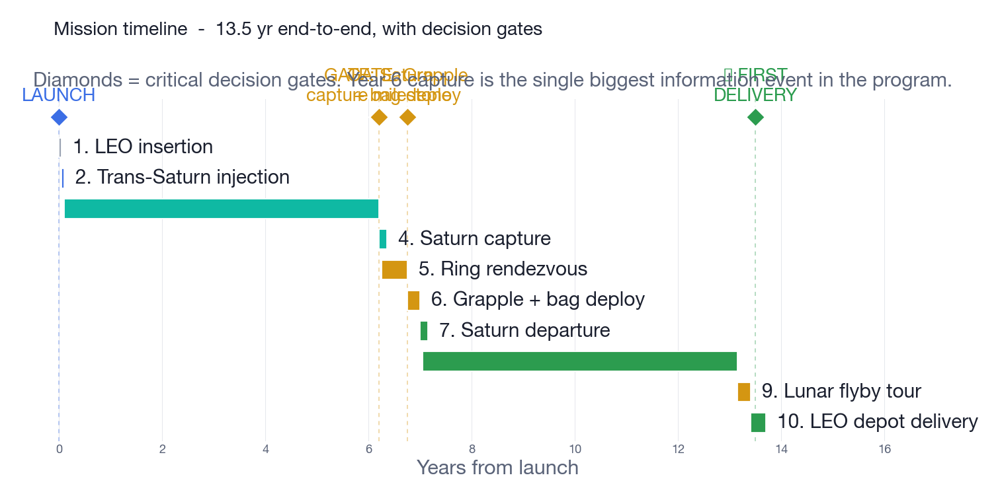
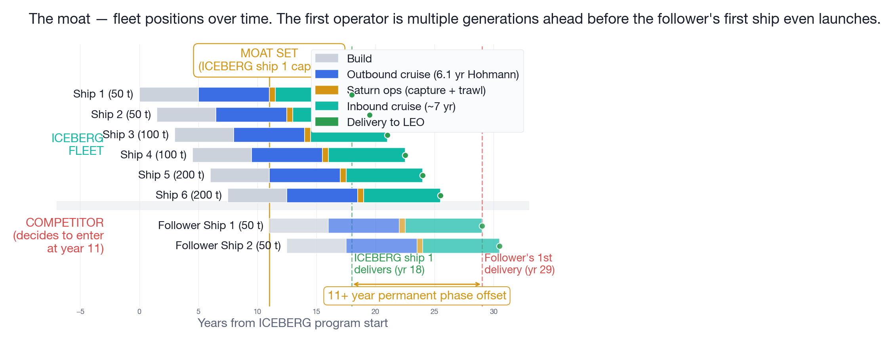
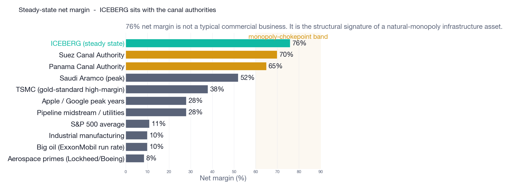
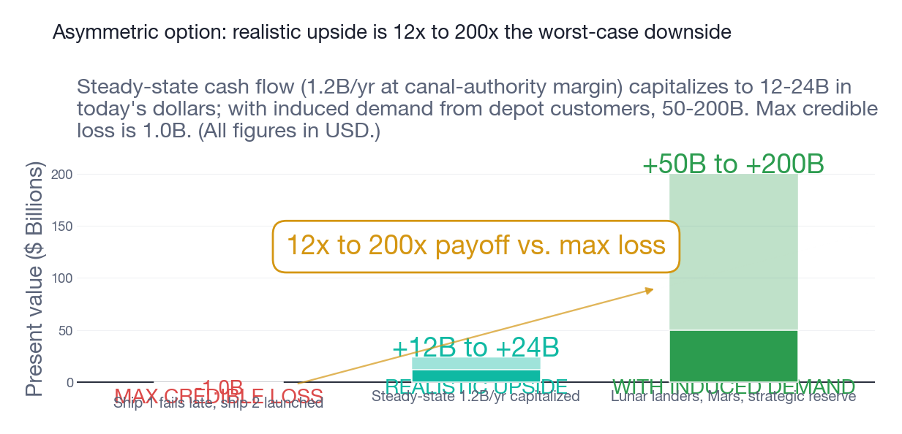
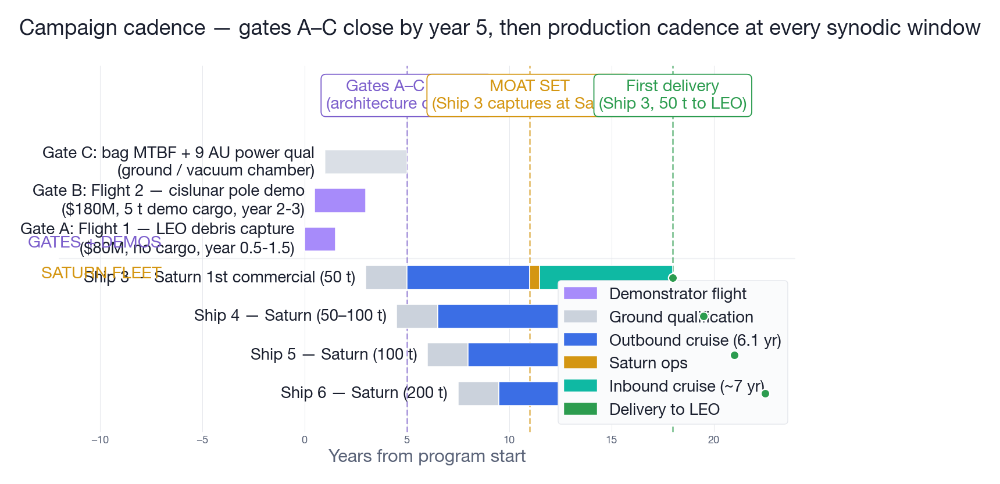
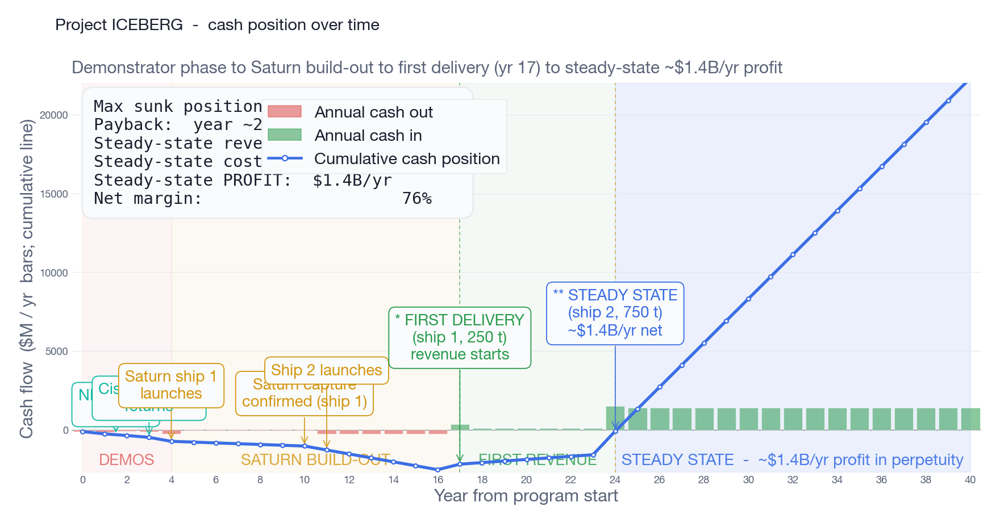

# Project ICEBERG — Concept Paper / Discussion Draft

**A long-horizon mission concept for harvesting Saturnian B-ring water ice using a water-microwave-electrothermal-thruster (MET) propulsion stack.**

> **Reader's note, post-latest+9 2026-05-15 — three open tensions, full pitch rewrite still blocked.** Three integration items since the latest+7 reader-note below:
>
> **A. iapetus four-round chain settles program-class.** Synthesis round + three robustness rounds + an absolute-ceiling-rigor round (`eab4b13`, `b03b3e2`, `d05f9a8`, `9a556b3`) bound the joint posterior on flight-reactor-availability inside the 2032-2035 demonstrator window. Max conjunction posterior 0.0055% (US-only baseline) to 0.77% (global high-scope); 2.7% absolute ceiling with all conditional priors set to 1.0. Below the venture-class threshold (10%) under every assumption combination tested. **Formalised as REQUIREMENTS v0.8 L0-24**: commercial-class mission launch is hard-conditioned on a flight-qualified reactor program (specific power ≥ 8 W/kg or ≥ 5 W/kg under hybrid-aerocapture; lifetime ≥ 10 yr cumulative full-power burn) being on contract before Gate D close. Demonstrator-class missions are exempt. L0-13 capital-structure framing forced to government-grant / sovereign-research-grant as the operative compliance pathway.
>
> **B. Engineering-closure data preserved under retired axis 19.** Titan-2 Block-4 R-residence-exit-maneuver (`513fe06`): composite configuration (Earth aerocapture + Jupiter return GA + Isp 7000 exit + 20 t hardware jettison) closes residence-class to central 21.8% delivered fraction (range 16.3-27.3%), exceeding Option A's 17%. **This is engineering closure of an architecturally-retired option.** Project-owner ram-scoop retirement at latest+6 was on foundational-premise grounds (defeats chunk-as-propellant-tank Δv lever) independent of engineering closure; the matrix preserves the data as input under axis 19 footnote and does NOT revive the architecture. Surfacing here because the data is a candidate input for a project-owner re-examination of axis 19 if the foundational-premise reasoning changes; not because the architecture is back.
>
> **C. Pricing-anchor question opened mid-pass.** Project-owner challenge: "$1,400/kg does not accurately reflect what can be charged." The pitch headline anchors at Falcon-Heavy / Falcon-9 launch displacement ($1,400-2,800/kg); the demand doc already disagrees (anchor-era blended $3,000-5,000/kg, DoD strategic reserve $10-25k/kg one-shot, ISS-CRS effective ~$25-50k/kg). The disagreement is whether the operative anchor is bulk-supply displacement or mission-essential willingness-to-pay. SCOPE'd as R-pricing-anchor-revisit (`water-prop/rounds/R_pricing_anchor_revisit/SCOPE.md`); seven hypotheses on willingness-to-pay ceilings, competing-supply floors, novelty premium, regulated-utility framing, monopoly-rent extraction. **H7 is load-bearing**: does pricing correction flip the program-class verdict, or is the iapetus L0-24 reactor-program-availability constraint binding regardless? **Full pitch rewrite is blocked on H7.**
>
> **Two tensions, not resolved in this reader-note:**
> 1. Iapetus says **program-class technology-demonstrator-only at conservative anchors** (reactor-program-availability is the binding constraint). Titan-2 Block-4 says **engineering closes at 22% via composite architecture**. Both correct: engineering closure ≠ reactor-program availability. The honest framing is probably *primary posture = research-grade demonstrator (because reactor-program posterior binds first); conditional optionality = regulated-utility (contingent on FSP Phase-2 contract or equivalent shock)*. **Project-owner direction needed before the rewrite.**
> 2. The pricing-anchor question can shift the regulated-utility-class threshold materially. R-pricing-anchor-revisit H7 is the deciding round; pitch should not be rewritten until that round closes.
>
> **What this reader-note does NOT do:** rewrite §4 (capital framing), the era revenue table, or the moat / pricing prose in §3.4 / §6. Those wait for R-pricing-anchor-revisit + iapetus/titan-2 framing reconciliation. The body below remains at the late-evening / latest+7 state with prior reader-notes still applicable.
>
> For current state: `REQUIREMENTS.md` v0.8 (L0-24 + L0-13 parenthetical), `water-prop/docs/ARCHITECTURE-DECISION-MATRIX.md` latest+9, `water-prop/PROTOCOL.md` (methodology lessons 10-12), `.planning/active-sessions.md` latest+9 registry, `water-prop/rounds/R_pricing_anchor_revisit/SCOPE.md`.

> **Reader's note, post-latest+7 2026-05-15 — the matrix is now empty under every anchor and waiver tested; the honest pitch posture at flown anchors is technology-demonstrator-only.** The water-prop R&D campaign now totals forty-plus pre-registered rounds. Five integration passes have landed since the late-evening block below: kill-shot pass (latest+3, hyperion R-no-atmospheric-capture-baseline: zero of 288 cells close without aerocapture), three-handoff integration (latest+5, rhea R7 + phoebe + titan-2 SOI + ram-scoop reframe surfaced), project-owner decision on ram-scoop (latest+6, retired — adds 14.7 km/s Saturn-side Δv, contradicts ICEBERG's foundational chunk-as-propellant-tank Δv lever), five-handoff integration (latest+7, Architecture E falsified under flown-anchored specific power + reactor lifetime is third viability axis + single-pass aerocapture closed + project-owner USER-NOTES heterogeneous-cadence hypothesis falsified). **Four load-bearing updates over the late-evening reader-note below:**
>
> **A. The matrix is empty under every anchor.** Architecture E was the surviving cell under L0-05 ≥ 25-yr waiver at 4.78 percent posterior; enceladus-r5 R-arch-E-specific-power-flown-anchored (`62f7079`) + R-specific-power-cliff (`2d63291`) close it: round-6's "two mass models" (decomposed_marvl + bundled_10) are mathematically equivalent (60/60 cells match); closure cliff between 7 and 8 W/kg specific power; KRUSTY 2.4 W/kg gives 0 close cells. R-aerocapture-cliff-shift (`12058b5`) shows inbound aerocapture rescues the 5-8 W/kg band but **cannot rescue KRUSTY-anchored cells — outbound burn becomes binding** below 5 W/kg.
>
> **B. Reactor lifetime is a third viability axis.** R-reactor-lifetime-vs-burn-time (`c685c52`): every viable Architecture-E cell needs 8-12 years of cumulative reactor full-power burn time. KRUSTY 2018 ground-test heritage is 28 hours — 3-4 orders of magnitude short. Restoring any surviving cell requires a reactor program targeting ≥ 5 W/kg specific power AND ≥ 10-year flight lifetime AND ≥ 500 kWe scope simultaneously. No funded US program targets this conjunction. R-reactor-specific-power-program-targets (SCOPE authored latest+7) will quantify the joint posterior.
>
> **C. Single-pass aerocapture closed; only hybrid remains as candidate.** Phoebe R-chunk-as-heat-shield-revisit (`9b3d29e`): zero of 40 cells achieve single-pass capture at periapsis ≥ 50 km; ICEBERG ballistic coefficients (4600-6600 kg/m²) are too high; binding constraint is capture-feasibility itself, not bag-thermal or chunk-structural. The matrix's prior "aerocapture-conditional" rows reframed to "hybrid-aerocapture-only-conditional." R-hybrid-aerocapture-aerobraking (hyperion SCOPE) is the sole architecturally-credible aerocapture-adjacent candidate; has not been run.
>
> **D. Project-owner USER-NOTES hypothesis falsified.** Rhea R-heterogeneous-cadence (`2e85d4f`) directly tested project-owner USER-NOTES on axis 02 (does fast-small mission 1 + larger-slower 2..N improve program NPV?). Score: 2 held, 6 falsified. Chunk-shrinking loses NPV in every regime tested. Staged-commitment via go/no-go gates A-C HOLDS as a structure (decoupled from chunk-size variation).
>
> **Net direct effects on this paper's economic framing:** the late-evening reader-note below restored "regulated-utility-class under aerocapture closure + L1-007 relaxation" as a recoverable framing. **That path is now closed by R-aerocapture-cliff-shift's outbound-binding finding** — even if R-hybrid-aerocapture-aerobraking closes perfectly, KRUSTY-anchored specific power kills the cell. The honest capital framing at flown anchors is **government-grant / technology-demonstrator only**. Regulated-utility-class requires reactor-program targets that don't currently exist (per A-REACTOR-SP + A-REACTOR-LIFE in RISKS.md latest+7). Held architecture (chunk-rendezvous; ram-scoop retired) carries three open engineering questions — hybrid-aerocapture closure + B-ring-rendezvous-survivability + reactor-program-targets — all of which must close for any surviving commercial cell. **The full pitch rewrite remains queued**; this reader-note continues to be a placeholder that flags the cumulative falsifications. For current state see `water-prop/docs/ARCHITECTURE-DECISION-MATRIX.md` (latest+7 axes + HISTORY blocks), `design-axes/INDEX.md` (twenty axes; axes 02 / 12 / 19 / 20 most-recently touched), `RISKS.md` (re-scored A-REACTOR; new A-REACTOR-SP, A-REACTOR-LIFE, M-RNDZ-IMPACT; reframed M-AEROCAP-HYBRID; tightened B-FUND).
>
> **Reader's note, post-late-evening 2026-05-15 — major architecture AND economic revision; the year-twenty-plus story and the sovereign-development-discount-rate-territory framing both do not survive.** The water-prop R&D campaign now totals twenty-five-plus pre-registered rounds. Evening four-worker pass (titan / hyperion / enceladus / rhea, twelve rounds) integrated alongside four user-locked R-power-wonder findings. Late-evening pass integrates three additional handoffs (worktree-110450, enceladus-r5, rhea-2 — six rounds combined). **Three load-bearing headlines:**
>
> **1. Year-twenty-plus megawatt all-electric end-to-end is structurally falsified.** Under Modular Assembled Radiators for Very Large systems (MARVL) anchored mass (radiator subsystem 40–55 percent of system mass at megawatt scale per National Academies / NASA studies) and continuous-thrust electric delta-velocity (24.7 km/s inbound + 29.56 km/s outbound vs the matrix's 6.42 km/s impulsive each way), no megawatt all-electric cell closes inside L0-05's 15-year ceiling. Closest miss at 1 megawatt-electric: round-trip 19.56 yr, delivered −34.4 tonnes. Year-twenty-plus revival depends on R-chunk-as-heat-shield-revisit closing.
>
> **2. Year-zero-through-fifteen "Kilopower Variant B" survives but is restated as "500-kilowatt-electric all-electric inbound" at 17 percent delivered fraction.** Per rhea Round 3 (commit `47b69bc`), chemical-trim at Earth capture does NOT save Variant B — it makes the cell worse. Chemical exhaust velocity is 4.45× lower than electric; a smaller chemical burn eats more propellant than the larger electric burn it replaces. Project-owner-locked Option A: cell restated as 500-kilowatt-electric all-electric inbound at 17 percent delivered (no chemical trim). Outbound chemical kick stage at Earth departure preserved; inbound is all-electric continuous-thrust. The matrix's prior 27.6 percent / 70 percent delivered-fraction numbers are retired. Reactor-program contingency remains (500-kilowatt-electric is 5× Fission Surface Power Phase 2's 100-kilowatt-electric scope; Phase 2 has not been awarded as of May 2026; per the 0-of-6 base rate of US space-fission programs reaching orbit since SNAP-10A, posterior probability of an available 500-kilowatt-electric reactor by the 2032–2035 demonstrator window is in the 0.10–0.30 range). Architecture D is split into D-fission (location-agnostic) and D-solar-thermal (Saturn-orbit-only) per enceladus-r5 Rounds 3-4; program is reframed as **Saturn-side-Technology-Readiness-Level-bet-limited**, not fission-bet-limited.
>
> **3. The "sovereign-development-discount-rate territory" framing is retired.** R-NPV's 4-7 percent project internal-rate-of-return was conditional on decomposed-mid radiator mass (now retired) and an optimistic reactor-arrival distribution (now retired). Under MARVL-anchored mass + R-power-base-rate reactor distribution, marginal internal-rate-of-return is **1.45 percent — sub-sovereign-bond, not within the sovereign-development band.** Hurdle crossovers (R-delivery-irr-curve / worktree-110450): sovereign-bond (~4 percent) at 209 tonnes-per-ship; regulated-utility (~8 percent) at 461 tonnes-per-ship; corporate-growth (~10 percent) at 691 tonnes-per-ship. The 200-tonne L1-007 chunk-mass cap puts the project below the sovereign-bond hurdle. **Aerocapture closure is necessary but NOT sufficient** to restore a return-seeking-capital framing; L1-007 relaxation (toward the B-ring single-chunk physical cap of 482 tonnes-per-ship) is also required.
>
> **Direct effects on this paper's headline numbers:** (1) the steady-state-tier "$1.3–2.3B/yr" line in the era table is structurally infeasible under conservative assumptions; only the entry-tier (year-zero-through-fifteen) survives, and only at a 500-kilowatt-electric reactor that has not been funded; (2) the chunk-mass cap is ≤ 200 tonnes per mission (not 1000 tonnes), so the 500–1000 tonne steady-state column does not represent an achievable architecture; (3) the megawatt-era "no on-orbit assembly required" claim is inverted — megawatt all-electric end-to-end requires ~559 tonnes at low Earth orbit, 5–9× any flying or near-term-flying launcher; (4) **the "Suez Canal, not Amazon" sovereign-development framing in §3 and the capital-stack analysis in §4 (8.7 percent blended cost of capital, 12.9 percent project internal-rate-of-return, +$1.3 billion net-present-value) are retired by R-reactor-roadmap.** The audited project profile is sub-sovereign-bond at current architecture. For the current architecture state, see `water-prop/docs/ARCHITECTURE-DECISION-MATRIX.md` (late-evening section), `REQUIREMENTS.md` v0.6, `REQUIREMENTS-L1.md` v0.3, `RISKS.md` (re-scored A-REACTOR + B-FUND). **A full pitch rewrite is required**; this reader-note is a placeholder that flags the falsifications while the prose body is reframed in a follow-on pass.

---

## The pitch in four sentences

1. A 13-year round-trip to Saturn to collect a 50-ton iceberg of B-ring water and bring it home would completely flip the space economy — nobody launches water, oxygen, or fuel out of a gravity well ever again. (§1)
2. Even if the first mission were a coin flip — and it's much better than that after Gates A–C close — the bet still pays, because once steady-state cadence kicks in you book sovereign-wealth-level cash flow indefinitely (~$1B+/yr, profit, for as long as anyone in space needs water). (§4, §5)
3. The first operator to deliver a Saturnian iceberg owns an irrevocable moat on in-space water — and the moat locks in at year 6 (Saturn capture proven), not year 18 (first LEO delivery), because by then ships 2 and 3 are already in cruise behind the proof. (§3)
4. The only organizations that could realistically catch up are state actors (CNSA, Roscosmos), and the only reason they'd want to is to secure their own national supply — fine, they can spend a few billion duplicating the architecture, or they can pay the first operator, the way everyone pays the Panama Canal Authority. (§3)

---

## TL;DR

**ICEBERG is additive to any lunar / cislunar thesis, not a substitute.** Lunar polar ISRU is the right architecture for the first decade of in-space water demand and §3.4 concedes it explicitly. ICEBERG is the second-decade architecture — the bulk LEO-depot supply that compounds the lunar play into a permanent monopoly on water in space. **Lunar wins decade one; ICEBERG wins decades two and beyond; an operator running both lines owns the entire arc.** That's the defensible long-term plan.

The orbital economy runs on water, and today every kilogram is launched from Earth at $1,400–25,000/kg.[^launchprice] The premise of in-space water depots is that they replace Earth-launch as the upstream supply. **Project ICEBERG is one long-horizon mission that delivers on that thesis** — harvest Saturn's B-ring using a water-MET stack plus one new subsystem (a trawl bag).

Three claims:

1. **Buildable on existing in-space-tug-class hardware** (per public sources) plus one already-funded reactor program (Kilopower) the operator doesn't have to develop. (§1, §2)
2. **The trawl bag is the only meaningful technical unknown, and is bought down progressively on Earth, in LEO, and at the Moon before any Saturn dollar is committed.** Integration problem in known disciplines, not a bet on unproven physics. (§5)
3. **What ICEBERG buys is positional control of in-space water at scale.** The moat is set by orbital mechanics, not capital; once the first ship captures a chunk — years before delivery — the lead is structurally uncloseable on any timescale relevant to a competitor's investors. (§3)

#### *Note*: A "chunk" is the single block of B-ring ice one ship returns; size is bounded by reactor power, and the cargo doubles as the inbound propellant tank.[^chunk]

The economics fall out of all three. **Order-of-magnitude scenario sketch — these are unit-economics multiplications (chunk × $/kg) at canal-authority operating-cost ratios, not a financial model.** A real model needs the operator's internal opex curve, depot-demand projections, and induced-demand response, none of which are in this paper. Read the eras as a *trajectory shape*, not a forecast:

| Era                        | Chunk Target Size | Revenue per ship (one delivery) | Annual run-rate at sustained cadence |
| -------------------------- | ----------------- | ------------------------------- | ------------------------------------ |
| Entry tier (Kilopower-era) | 50 t              | ~$400M                          | ~$370M/yr                            |
| Mid program (FSP-era)      | 200 t             | ~$700M                          | ~$550M/yr                            |
| Steady state (sub-MW+ era) | 500–1000 t        | ~$1.3–2.3B                      | ~$1.2–2.1B/yr                        |

> **Reader's note (post-evening 2026-05-15):** the table above does not survive the rhea / titan / R-power-wonder integration. The "entry tier" row should be retitled "500-kilowatt-electric chemical-kick + electric-inbound" — chunk cap ≤ 200 tonnes per mission per L0-05 compliance. The "mid program" row's 200-tonne chunk is now the *binding ceiling*, not a midpoint. The "steady state" row's 500–1000 tonne chunks and the implied megawatt all-electric end-to-end architecture are **structurally infeasible** under continuous-thrust electric delta-velocity + MARVL-anchored mass; the row is retained here only as audit-trail of the original framing. Restated post-falsification revenue table will land in a follow-on pitch rewrite.

*Per-ship is the gross revenue from a single ship's delivered chunk priced at Earth-launch displacement cost. The annual run-rate is what the operator books per calendar year once the fleet has reached sustained cadence — one ship returning every ~13 months at the Earth-Saturn synodic window — i.e. per-ship × ships-arriving-per-year, not a restatement of the same number. The two columns differ because the synodic window is slightly longer than one Earth year.*

Full table with margin context and the floor-pricing case is in §4.


---

## 1. The mission, in five steps




1. **Launch.** Falcon Heavy lofts a ~50 t stack to LEO. A chemical kick stage (e.g. Vulcan-Centaur) performs the 7.3 km/s Trans-Saturn Injection burn and is jettisoned. **Combined launch + TSI: ~$250–280M (Falcon Heavy expendable ~$150M public + Vulcan-Centaur ~$110M public), and this is the only non-water-MET propulsion in the entire ~13-year round-trip mission.**
2. **Cruise + capture.** Hohmann transfer to Saturn (~6.1 yr). At Saturn arrival, multi-pass low-thrust capture using water-MET — same low-thrust capture technique NASA Dawn used at Vesta and Ceres. Cruise operations are mostly autonomous — Cassini ran a ~$60M/yr ground-ops budget in 2000s dollars on a much larger team; ICEBERG can run a small flight-ops cell remoting in from anywhere with a laptop and a DSN scheduling agreement, conservatively **~$15–25M/yr × 6 yr ≈ $100–150M cruise opex.**
3. **Trawl.** Drop into circular orbit at the B-ring radius. Deploy a Vectran/aerogel-lined trawl bag. Induce mm/s radial drift; particles enter the intake; soft-fabric and aerogel layers decelerate them inelastically. Collection completes in hours to days. Saturn one-way light-time is ~75–90 minutes, so the entire trawl-and-cinch runs autonomously — **the moment the program lives or dies, and we won't know for ~83 minutes**. Onboard autonomy is the second-largest risk after the bag itself (Phase 5b in the conops).

   **Three bag-physics questions a propulsion engineer asks within 30 seconds, and where each currently bounds.**

   - **Particle size cull.** B-ring distribution spans millimetre dust to metre-class boulders (Cassini Radio Science / Ultraviolet Imaging Spectrograph observations). At 1 mm/s closing rate, a 1 m, ~500 kg ice boulder carries ~0.25 mJ of kinetic energy distributed over the bag aperture wall — trivially below any ballistic-fabric energy budget. A 10 m, ~470 t boulder at the same closing rate carries ~0.24 J — still within Vectran budget on energy alone, but it does not fit through the intake. **The cull problem is geometry-driven, not energy-driven; the architecture cull is a gated aperture (mesh pre-screen sized to the largest body that fits) plus an active reject maneuver if a too-large body is detected by forward-looking lidar inside the approach corridor.** Sizing the mesh and lidar reject loop is open Gate-A engineering work; corrected derivation in `ICEBERG-bag-engineering.md` §0.1 and §3.
   - **Permeability budget.** Aerogel-lined Vectran laminate vapor permeability over a 7-year inbound coast at sun-facing wall temperatures of 200–280 K is an open number. **Bound:** if more than ~5% of cargo mass is lost to leak across the inbound coast, chunk-fed ΔV no longer closes Tsiolkovsky at the assumed Isp. That's the engineering target for the laminate; whether it's achievable with current materials or needs a metallized inner liner is a Gate-A bench-test answer, not a paper answer.
   - **Stationkeeping during fill.** As cargo accretes, the c.o.m. walks and orbital radius perturbs. **Order-of-magnitude:** for a 50 t fill at the B-ring radius (~117,000 km from Saturn center, orbital velocity ~17 km/s), maintaining a few-hundred-meter station-keeping box during a multi-hour fill costs O(10 m/s) of MET ΔV — small against the §2 budget but not zero. Sized in conops §bag-design; flagged here so it isn't missing from the §2 ΔV table.


4. **Heat-pipe topology.** Cinch the intake. Sun-facing wall sublimates particles; cold-side wall (<150 K) cryopumps vapor as frost; heated harvest port re-sublimates frost on demand and meters vapor to the propulsion feed. **The cargo is simultaneously cargo and storage.**


5. **Inbound + delivery.** Multi-pass low-thrust Saturn departure on chunk-fed water-MET, then a 7-year inbound coast with continuous chunk-fed thrust (retrograde for the second half — by Earth approach the spacecraft is already most of the way to capture velocity). **Earth insertion is a multi-flyby lunar-gravity-assist (LGA) capture sequence plus low-thrust trim to LEO depot, all on residual chunk water.** A 2–3 flyby LGA tour subtracts ~2–4 km/s of v∞ at zero propellant cost — well-trodden ground (Hiten, WIND, Geotail, ARTEMIS, WMAP) and JPL's MALTO/SCOPE solves exactly this trajectory class. **Aerocapture is not viable** at any plausible atmospheric pressure — 50–1000 t of ice arrives as vapor — so LGA + propulsive trim is the only architecture that delivers an intact block to LEO.


**Comms architecture.** A modest Ka-band HGA on the spacecraft + a NASA DSN 34m/70m dish closes at ~kbps-class at 9 AU — telemetry and command uplink, no video. Compatible with the autonomy already required for the trawl. The DSN (Goldstone / Madrid / Canberra) plus ESA's ESTRACK are the only operational deep-space ground assets; commercial providers (LEAF, ATLAS, KSAT, AWS GS) do not offer Saturn-class service on any contractable timeline. **NASA contracts time slots on DSN, it does not sell bandwidth as a service** — a standing allocation for an ICEBERG fleet (4–5 ships in cruise) is one of the things the §2 NASA-relationship leverage window has to secure.

Steps 3 and 4 depend on the trawl bag; developing it is the central engineering risk. However, §5 retires it through three demonstrator gates before any Saturn flight launches.

---

## 2. The math closes, and chunk size scales with reactor tech

**ΔV budget (impulsive-equivalent).** Round-trip total ~17–19 km/s impulsive-equivalent with a 2–3 flyby lunar-gravity-assist capture sequence (§1 step 5). Aerocapture is not viable; LGA is the propellant-free arrival ΔV reduction that recovers most of what aerocapture would have given us. One chemical burn from Earth, electric on water-MET everywhere else, plus the LGA tour. Continuous-thrust spiral legs cost more than impulsive-equivalent values; see footnote [^contthrust].

| Phase | ΔV (km/s) | Propulsion | Propellant source |
|---|---|---|---|
| Trans-Saturn Injection | 7.3 | Chemical kick stage | Earth-loaded, jettisoned |
| Saturn capture (low-thrust) | ~1.0 | Water-MET | Earth-launched water |
| Ring rendezvous + station-keeping | ~0.5 | Water-MET + RCS | Earth-launched water |
| Saturn departure (low-thrust spiral + Titan assist) | ~5.5–7.7 | Water-MET | **Chunk-fed** |
| Inbound cruise braking (continuous retrograde) | ~2.0 | Water-MET | Chunk-fed |
| Lunar-gravity-assist tour (2–3 flybys) | ~2.5–3.5 | Gravity (free) | None |
| Earth low-thrust orbit trim to LEO | ~0.5 | Water-MET | Chunk-fed |
| Final RCS trim into depot orbit | ~0.2 | Water RCS | Chunk-fed |
| **Round-trip total (chemical + electric, impulsive-equivalent)** | **~17–19** | | |


Only 7.3 km/s is bought as chemical; the rest runs on water-MET, with Earth-launched propellant outbound and chunk-fed propellant inbound. **Inbound chunk-fed ΔV totals ~8–10 km/s impulsive-equivalent** (Saturn departure 5.5–7.7 + cruise braking 2.0 + Earth trim 0.5 + RCS 0.2), with the LGA tour absorbing ~3 km/s of arrival ΔV at zero propellant cost. Under impulsive accounting this gives **~22–30% chunk delivery efficiency at Isp = 700 s**. Under continuous-thrust (low-thrust spiral) accounting — the regime ICEBERG actually flies — the Saturn-departure and Earth-spiral legs cost 3.8–6.3× their impulsive value (per the water-prop campaign's continuous-thrust audit), and the delivered fraction falls to **~17–28%** at the Isp the surviving cells run (1000–2000 s). The reactor table below is sized in *delivered* chunk mass, so this derate sets how much raw ice each ship must capture.[^isp][^contthrust]

The LGA reduction is **consistent across the fleet program, but per-flight cost varies on a ~9-year cycle** with the lunar nodal regression.[^lganodes] Most arrivals net the full ~3 km/s with ~10–30 m/s of mid-course-correction ΔV (trivial against the chunk-fed budget); unfavorable-declination arrivals net ~2 km/s and require either ~50–100 m/s of MCC or up to 3 months of Earth phasing-orbit time before final flyby. Per-flight delivered chunk varies by ~10–15% across the cycle; each ship's trajectory is solved bespoke during mission design. **No arrival window is geometrically impossible.**

The LGA tour adds ~3–6 months of Earth-Moon system maneuvering before final LEO insertion, but the ship has been in cruise for 7 years; a few months in lunar-resonance orbit is cheap. JPL's MALTO/SCOPE low-thrust + gravity-assist optimization toolchain is the industry-standard solver for this trajectory class and is freely usable under NASA tech-transfer.

**Mass.** A first-flight stack at ~50 t pre-TSI fits within Falcon Heavy expendable (64 t). The bag's mass is roughly fixed regardless of how much ice it holds, so as chunk size grows across program eras, the useful payload fraction grows: bag overhead amortizes across more cargo, and more cargo means more inbound ΔV without launching extra propellant from Earth. **Both effects compound the same direction.**

**The binding constraint isn't ΔV or mass — it's electrical power.** Saturn-class chunk masses need ~1 kWe per ~25 t of delivered chunk over a 7-year inbound coast. At 9 AU, solar flux is 1.1% of Earth-equivalent — solar is dead. The mission needs nuclear electric, and **the size of the available reactor sets the upper bound on chunk size.**

| Reactor class | Power | Status (May 2026) | Chunk enabled |
|---|---|---|---|
| **Kilopower / KRUSTY**[^kilopower] | 1–10 kWe | Full-power ground test, NNSS, 2018 | **50 t** |
| **NASA Fission Surface Power**[^fsp] | ~40 kWe | Phase 1 contracts (LM, Westinghouse, IX, BWXT) 2022; late-2020s flight target | **100–200 t** |
| **Sub-MW to MW-class flight units**[^megawatt] | ~100–500 kWe (early flight scale of MW-class designs) | Roadmap; nearest analog DRACO is NTP not NEP. 2030s–2040s | **500–1000 t** |

**An operator does not need a megawatt reactor for flight 3** — Kilopower is enough. Each reactor generation arrives on its own NASA / DOE / DARPA timetable, independent of ICEBERG. The operator ratchets up chunk size as those programs deliver, with no reactor R&D on the operator's books.

**What if FSP and Megawatt both slip indefinitely?** The program is still viable on Kilopower alone. Two paths back to ~$1B/yr without ever leaving Kilopower:

- **Single-ship-per-window cadence**: 50 t delivered chunk × one delivery per 13-month synodic window ≈ **~$370M/yr** at sustained cadence (§4 row 1). A real mid-cap aerospace business on its own.
- **Multi-ship cadence**: launch one ship every 4–5 months instead of every 13 months. Each ship still takes 13 years round-trip, so steady-state has 30–40 ships in flight with **3–4 ships arriving per year**. At 50 t × 3.5 ships/yr × ~$1,400/kg displacement ≈ **~$1.0–1.2B/yr at the entry tier alone**, with built-in fleet redundancy (one ship failure ≈ 25–33% revenue dip for one year, not a program-ender) and operating-cost headroom because Saturn-side ops barely scale with ship count.

The era ramp in §4 is the *upside path*; the floor is "Kilopower works, FSP/MW are bonuses." Reactor scale-up multiplies the prize but isn't load-bearing for the thesis to close.

---

## 3. The moat — physical, not engineering

ICEBERG's moat is structurally different from any other commercial-space moat. SpaceX's reusable-launch lead is engineering; Blue Origin can and is matching it. TSMC's process-node lead is capital; a $20B fab buys the next node. **ICEBERG's moat is orbital mechanics**, which is not negotiable with capital, IP, technology, or political will.



### "13 years is too long" is the wrong frame

Yes, a 13-year round trip is a long mission. But the **asset and market dominance lock in at year 11 (Saturn capture), not at year 18 (first LEO delivery).** And that 11-year horizon is short by the standards of every infrastructure asset of comparable economic gravity:

| Asset | Build time | Inflation-adjusted cost | Result |
|---|---|---|---|
| Panama Canal (1881–1914) | ~33 years (incl. French failure) | ~$11B in today's dollars | Permanent geographic chokepoint, ~$3B/yr in tolls |
| Suez Canal (1859–1869) | 10 years | ~$3.5B today | Permanent chokepoint, ~$8B/yr in tolls |
| TSMC 2nm fab build-out | 5–7 years per node | ~$20B per fab | ~5-year lead, capital-replicable |
| Three Gorges Dam | 17 years | ~$60B today | Permanent generation asset |
| ICEBERG to Saturn capture | 11 years | ~$1B max committed | **Permanent solar-system chokepoint** |


ICEBERG is the *cheapest and fastest* example on that list. It's also the only one where the moat is set by celestial mechanics rather than capital.

**11–20 years is normal for space infrastructure.** Cassini was 9+7+13. JWST was 24 from concept to first light. Investors who fund space programs already underwrite this duration; the question isn't whether 13 years is fundable, it's whether ICEBERG is the highest-EV asset *among* multi-decade infrastructure plays. Per §4, it is.

### Capture is monetizable seven years before delivery

The standard read is that the moat sets when the first chunk arrives in LEO. **That's wrong** — it sets seven years earlier, at Saturn capture (program year ~11). From that moment, the architecture is *demonstrated*. The first ship just has to coast home, and ship 4 is already in cruise behind it.

**More importantly, the captured chunk plausibly becomes a financeable asset at year 11, not year 18.** This would be a novel asset class — there is no direct precedent for collateralizing a physical asset 9 AU away with no inspection possible. The closest analogs from extractive industries point in the right direction without proving the case:

- **Reserve-based lending (RBL)** is the workhorse financing mechanism for oil-and-gas E&P operators: banks lend against proven undeveloped reserves at advance rates of 50–65% of NPV. The disanalogy is real — oil reserves are physically inspectable with a century of geological precedent; a captured Saturn chunk is not. The analogy is real too — once trawled and cinched, the chunk is the most-water-pure asset in the solar system, with a known buyer (LEO depots) and a known price ceiling (Earth-launch displacement).
- **Forward sales / offtake agreements** are a second layer: lock in post-delivery revenue with depot operators or sovereign customers against captured-but-undelivered cargo. Mining and LNG industries do this on 10–20 year horizons; ICEBERG's 7-year gap between capture and delivery is well inside that envelope.
- **Sovereign strategic-asset purchase** is a third and the most credible early avenue: a sovereign that wants off-Earth water as a strategic reserve can buy the captured chunk outright at year 11, with delivery contractually obligated in years 18–25. No new financing instrument required.

**Net: the program plausibly goes cash-positive at year 11, not year 18.** That re-financing capability is what shortens the load-bearing financial commitment from "the full 13 years" to "the demonstrator carry plus ship-1 cruise." It is not load-bearing for the §4 economics — even if every chunk has to physically arrive in LEO before booking revenue, steady-state cadence still closes the math. Worth flagging as upside, not as a relied-upon mechanism.

From proof-of-capture, here's where any follower stands, even one deciding to compete the same day:

1. Decide to compete. Their year 0.
2. Design + build their first ship: 4–5 years (a credible operator's pace).
3. Wait for the next Earth-Saturn synodic window: up to 13 months.
4. Fly outbound: 6.1 years.
5. Match what the first operator's ship just demonstrated: ~6 more months.

**Total: 11–12 years from their decision.** And by then the first operator has been delivering for ~5 years (first delivery year 18, follower's first delivery ~year 23 absolute earliest), with 4–5 ships in cruise at staggered chunk-size generations. **Annual run-rate at that moment**, per §4: ~$0.5–0.7B/yr at ~30% net margin in steady-state cadence — a real cislunar-infrastructure business that's been running for half a decade by the time the follower has anything to sell.

### Running the hypotheticals

An Earth-Saturn round trip *can* be matched. The relevant question is whether matching it changes the outcome.

**Case A — CNSA decides to compete the day the first operator captures.** Earliest CNSA delivery to LEO is program year ~23. By then the first operator has supplied the entire Western cislunar market for 5 continuous years; depot interfaces, refueling-port standards, and customer relationships are *operator-set standards*. Switching costs aren't "find a cheaper supplier" — they're "redesign the depot, requalify the propellant chemistry." The "Western customers won't buy" claim has a concrete enforcement vector: **CFIUS review of foreign-supplied space resources to U.S. depot operators (already-existing authority, applied analogously to telecom and undersea-cable infrastructure), DoD-SDA depot-anchor contracts that bind suppliers to U.S./allied origin, and ITAR/EAR re-export controls on the propellant once it enters U.S.-licensed depot infrastructure.** None of that is hypothetical; all three apply today to other cislunar hardware classes. Worst case: CNSA's delivery exists as a strategic reserve for China, not commercial competition. The operator's pricing is unaffected.

**Case B — Hostile policy forces the operator to sell to China.** Implausible given a realistic U.S.-aligned customer mix; even if forced, the operator remains the supplier, not the competitor.

**Case C — Faster transfer via NTP/NEP.** Saturn-class NTP/NEP doesn't exist; DRACO is cislunar NTP and Zeus has been roadmap-only for a decade. Even a 50% transfer-time cut puts a follower at 8–9 years from decision, with the first operator already delivering. The first operator can also adopt the technology — relative gap stays constant.

**Case D — Sovereign quietly preparing in parallel.** The realistic version isn't "starts the day the first operator captures" but a sovereign on a slow-roll roadmap since the program's announcement (CNSA's outer-planet cadence since Tianwen-1 makes "wait for the press release" wishful). Honest gap between the first operator's first delivery and a serious sovereign follower's: **3–5 years**, not 5+. Still decisive given depot-standard lock-in and the political-economy below, but tighter than the unsteelmanned version of this case claims.

**The shape of the situation.** Civilizationally, this is moon-landing-class — there is one "first" and the position is entered exactly once. Commercially, the closest analog is the **Panama Canal Authority** — owning a chokepoint whose moat is set by geography rather than capital, with full vertical integration over the upstream resource (B-ring water), the conversion (water-MET), the transport (the tug fleet), and the distribution (the LEO depot). The reason there isn't a closer historical analog is that **no one before has owned a chokepoint set by celestial mechanics.** OPEC controls supply but not geography (anyone can drill). Panama controls geography but not supply (water is everywhere). ICEBERG would control both, simultaneously, by physical law. **The moat isn't that competitors physically cannot reach Saturn — it's that there is no commercial space for them to land in when they get back.** That is the difference between an engineering moat and a *physical* moat.

### Lunar polar water ISRU is the real competitor — and likely wins the first decade

The honest competitive question isn't "can a follower reach Saturn." It's "can a follower deliver water to the LEO depot from somewhere closer than Saturn before the operator does." That somewhere is the lunar south pole, and the answer for the first decade of in-space water demand is **yes, lunar wins**. Artemis-adjacent capital is already flowing into VIPER follow-ons and commercial landers; in-situ extraction of polar regolith ice is on a 5–10 year horizon, not a 13-year one. **Anyone modeling ICEBERG as the only in-space water source is wrong, and ICEBERG is not the play for the first decade of demand. ICEBERG is the play for the second-decade demand curve, the one nobody can confidently point to today but everyone in cislunar logistics is betting exists.**

Three reasons the thesis still closes:

1. **Energy and gravity well.** Lunar surface → LEO is **~4.6 km/s of ΔV with aerobraking** (1.87 ascent + 5.93 low-lunar-orbit-to-LEO − 3.2 aerobraking savings, per the Wikipedia delta-v-budget table) — on every tonne delivered, *forever.* Saturn ring → LEO is **~5.5–7.7 km/s of chunk-fed Saturn-departure on water-MET** — but ICEBERG pays it *once at departure with the cargo as the propellant tank*, where lunar ISRU pays its ~4.6 km/s on *every* delivered tonne. The decisive lever is not per-tonne ΔV (which is comparable) but source concentration (reason 2 below): B-ring ice is ~99% water vs single-digit-weight-% lunar polar regolith.[^contthrust]

2. **Concentration vs. extraction.** Lunar polar ice is at single-digit weight-percent concentrations distributed across permanently shadowed regions; getting a tonne of water out requires processing tens of tonnes of regolith with thermal or mechanical extraction hardware that has to survive lunar night. B-ring particles are ~98% water ice. ICEBERG's "extraction" step is *hold a bag open.*
3. **Coexistence, not replacement.** Lunar ISRU is the right architecture for the lunar economy (surface bases, lunar landers, anything cislunar-internal). ICEBERG is the right architecture for *bulk LEO depot supply at scale.* The two markets overlap but are not the same. A reasonable end-state has both: lunar ISRU serves the surface and near-Moon traffic; ICEBERG serves LEO/GEO/Mars-injection depots.

What this changes about §4 pricing: ICEBERG's price ceiling is the cheaper of (Earth-launch displacement, lunar-ISRU displacement). Lunar ISRU at scale plausibly lands water in LEO at a lower nominal $/kg than Earth-launch but a higher one than ICEBERG steady-state — call it $800–1,500/kg as a planning band. The era table in §4 should be read against that ceiling, not Earth-launch alone.

### Resource law — the unmentioned moat-corrosion risk

Outer Space Treaty Article II prohibits national appropriation of celestial bodies. The Artemis Accords took a U.S. position on lunar and asteroid resource extraction; **Saturn ring material is not covered by either**, and the question of whether Saturn's rings *are* celestial bodies in the OST sense is unsettled. A sovereign-led ITU-equivalent body could plausibly attempt to regulate ring access in the 2040s. The mitigation is the same as the lunar/asteroid-resource case: establish operating precedent before regulation crystallizes, and bring the U.S. government in early as a strategic-resilience customer (§6 stream 4) so any future regulatory framework is shaped with American operators inside it. Worth flagging explicitly rather than pretending the legal landscape is clean.

**Planetary-protection (COSPAR) — separate problem, separately load-bearing.** OST Article II governs *appropriation*; COSPAR planetary-protection rules govern *contamination*, and they apply at Saturn whether or not the rings are "celestial bodies" in the OST sense. Cassini's end-of-mission Saturn deorbit was driven by the requirement to protect Enceladus and Titan from forward contamination. ICEBERG has both a forward problem (a 50–1000 t spacecraft loitering at the B-ring radius next door to two PP-priority targets) and a backward problem (returning ring material — water that has been in close-thermal contact with Saturnian moons via E-ring exchange — to LEO and ultimately to crewed depots). Neither is a no-go; both require an early COSPAR Category determination and a return-sample containment plan. **This is the regulatory work that would need to start in parallel with Gate A, not after.** Treating it as a year-10 problem is the failure mode.

The political-economy question therefore is not "can someone catch up" — by the time they have anything to sell, the first operator has owned the market for years — but "**does the U.S. want a U.S.-aligned operator to own the cislunar water supply by default, or does it want to wait and discover that no aligned operator does?**" A national-security-aligned business-development function inside the operator is structurally positioned for that conversation.

---

## 4. The economics

The moat sets the price. ICEBERG can price near Earth-launch displacement cost ($1,400–2,800/kg) because the customer's only alternative is launching the same water from Earth at that price.[^launchprice] No competing in-space water supplier exists, so customer pricing tracks Earth-launch over time. Chunk-size scale-up sets the volume: each reactor generation unlocks a bigger chunk, revenue scales roughly linearly, operating cost stays roughly flat.

**Floor pricing — does it close if Starship crashes launch?** At a $500/kg floor (between Starship's $200/kg target and Falcon Heavy), per-ship bulk revenue is $25M (50 t) / $100M (200 t) / $250M (500 t). The 50 t case doesn't close on bulk alone, but everything from FSP-class reactors onward does. **The natural monopoly protects margin, not necessarily pricing — and margin is high because operating cost barely moves with chunk size.**

**What follows is a scenario sketch, not a financial model.** Per-ship revenue is unit economics (chunk × $/kg displacement). Steady-state margin numbers are *asserted* at canal-authority operating-cost ratios, *not derived* from a defensible opex curve — actual operator opex curves, depot-demand projections, and induced-demand response would all sharpen the numbers below by an order of magnitude. The table shows the *shape* of the ramp, not a forecast.

**Reference-price reframing.** Per §3.4, by year 18 (first ICEBERG delivery) lunar polar ISRU plausibly already supplies LEO at $800–1,500/kg. The honest planning ceiling is therefore **lunar-ISRU displacement, with Earth-launch as the absolute upper bound** — not the other way around. The table below is now stated against the lunar-ISRU ceiling at the conservative $1,000/kg midpoint. Figures revise down ~30–50% in entry/mid tiers vs. an Earth-launch anchor; steady-state is largely unchanged because ICEBERG's marginal cost still beats lunar ISRU at scale (§3.4 reasons 1 and 2). Earth-launch-anchored upside (the figures previously shown in this section) is preserved as a row in §9 sensitivity.

**Reactor sovereign-risk caveat.** Kilopower has been cancelled-and-revived multiple times since 2018; FSP is paper-study Phase 1 (June 2022 awards); MW-class is roadmap-only. The era table should be read as **Kilopower-floor with FSP/MW as optionality**, not a guaranteed ramp. The thesis closes on Kilopower alone (§2 multi-ship cadence path); each higher reactor generation that lands is upside, not load-bearing.

| Era | Reactor (status May 2026) | Chunk | Per-ship revenue | Steady-state revenue | Steady-state margin | Path-dependency |
|---|---|---|---|---|---|---|
| **Floor** — ships 3+ | Kilopower (ground-tested 2018) | 50 t | ~$400M | ~$370M/yr (1 ship/window) → ~$1.0–1.2B/yr (multi-ship) | ~10–25% | Operator can underwrite alone |
| Upside A — ships 5–7 | FSP (Phase 1 → late-2020s flight) | 100–200 t | ~$500–700M | ~$550M/yr | ~30% | NASA/DOE deliver FSP |
| Upside B — ships 8–10 | FSP scaled | 300 t | ~$900M | ~$830M/yr | ~55% | FSP scales as planned |
| Upside C — ships 11+ | Sub-MW to MW (2030s–2040s roadmap) | 500–1000 t | ~$1.3–2.3B | $1.2–2.1B/yr | **~70%** | MW-class flight units exist |




At full steady state — once chunks scale to 500–1000 t — **net margin plausibly reaches ~70%**, alongside Suez Canal Authority territory. Earlier eras sit lower, ~10–30%, while chunk size is small relative to fixed operating cost. **The era table is the trajectory; the chart is the destination.**

A Saturn-system science sample stream is plausible on top of this (NASA New Frontiers / ESA L-class budgets natively underwrite multi-year sample-return programs in the $1B class, and Saturn-system sample-return has never been proposed at any cost), but it's speculative and not in the table above. **Bulk-water economics close on their own at flight 5+ even without it.**

**What the program is worth, plainly.** Once steady-state cadence is reached, deliveries continue indefinitely — the B-ring isn't depletable on any human timescale. Adding up ~20 years of FSP-and-up deliveries with a reasonable haircut for the time value of money, **the program is worth roughly $12–24B in today's dollars** under conservative assumptions, and **plausibly $50–200B** if depot demand grows the way most cislunar-economy projections expect.

**Induced-demand back-of-envelope (so the $50–200B isn't naked).** Today's *delivered* in-space water demand is dominated by ISS resupply (~5–10 t/yr) and a handful of station and lunar-precursor missions. The 10×–100× scenarios assume: (a) crewed lunar surface presence of 10–50 people consuming ~5 t/person/yr life-support + propellant share → 50–250 t/yr by mid-2030s, (b) Mars-injection depot demand of 200–500 t per launch window once a single human-Mars program goes operational → 100–250 t/yr amortized, (c) GEO and cislunar refueling for satellite-servicing fleets growing with on-orbit-servicing market projections → 100–500 t/yr. Total ~250–1,000 t/yr by 2045, vs. <50 t/yr today — a 5–20× growth from a tiny base, not a hockey stick. The $50–200B upside reaches it; if (b) slips, the $12–24B floor still closes. **None of (a)–(c) is committed; this is the demand-growth bet ICEBERG is being entered into, named explicitly.**

The fuzziness is deliberate — order of magnitude is the point.

### The bet, even at coin-toss odds

Set the success probability for the first Saturn ship at **50% — pure coin toss, zero credit for any demonstrator gate having passed.** That's more pessimistic than the historical failure rate of every outer-planet flagship NASA has flown. Walking the math:

```
Worst-case bet shape
─────────────────────────────────────────────────────────────
  Max credible loss            L  =  $1.0B   (program writeoff)
  Long-run program value       V  =  $12B (low) to $24B (high)
  P(success), worst case       p  =  0.50

  Expected upside    =  p × V       =  $6B   to   $12B
  Expected downside  =  (1−p) × L   =  $0.5B
  Net expected value =  $5.5B   to   $11.5B
  Upside / downside (probability-weighted)
                     =  12×    to   24×
─────────────────────────────────────────────────────────────
```

**Even at the worst-case probability, the bet returns $5.5B–$11.5B of expected value against ~$1B max exposure** — **12×–24× asymmetric**, *before* any credit for the gates that actually retire the technical risk. After Gates A–C close, success probability for ship 3 is realistically closer to 70%, and the asymmetric ratio gets larger from there; the headline number above is conservative on purpose.



---

## 5. The campaign — technical gates, not capital gates

Conventional aerospace would gate every capital decision: build ship 1, fly ship 1, *wait for ship 1 capture confirmation at year 11*, then commit to ship 2. **That cadence is wrong for ICEBERG.** §4's payoff justifies committing to fleet production the moment the *architecture* is validated — and the architecture can be validated on Earth, in LEO, and at the Moon long before the first Saturn ship reaches Saturn.

**Three technical gates validate the bag and the chunk-fed cruise architecture before any Saturn flight launches:**

| Gate | Year | Validates | By |
|---|---|---|---|
| **A — LEO debris capture** | 1.5 | First flight of the trawl bag. Deployment, intake aperture, inelastic capture, cinch-and-seal. | Flight (LEO) |
| **B — Cislunar pole demo** | 3 | Bag against real ice cargo. Chunk-fed water-MET feeding off the bag, hot/cold thermal cycle, heat-pipe vapor transport. | Flight (cislunar) |
| **C — Long-duration vacuum qual** | 5 | Bag MTBF, propulsion power scaling for 9 AU, autonomy software for the full mission length. | Ground / chamber |
| **D — Long-soak orbital testbed** | runs years 2–8, parallel | 13-year mission-equivalent radiation dose, thermal cycling, electronics single-event-upset accumulation, software-without-update operation. The Cassini/Voyager-class duration risk that Gates A–C cannot close on their own. | Flight (LEO/cislunar long-duration) |

**Honest read on the 13-year reliability claim.** Cassini and Voyager are existence proofs of multi-decade spacecraft operation, but neither did close-proximity uncooperative-target operations at 80+ minute light-time. ICEBERG asks for both. Gate C realistically buys ~3–5 years of accelerated-life qualification against a 13-year flight; the residual is bridged by (a) graceful-degradation design (the bag is the only single-point-of-failure subsystem; everything else is redundant or crosswired), (b) the cargo-as-shield architecture cutting GCR dose to internal electronics, (c) the Gate B cislunar demo flying for ~12+ months under realistic chunk-fed thermal cycling before the Saturn ship commits, and (d) **Gate D — a parallel long-soak orbital testbed running representative avionics, thermal loop, and autonomy stack continuously from year 2 through year 8.** Gate D doesn't fly the bag; it flies the *non-bag* subsystems for a calendar fraction of the mission so the integrated reliability number isn't pure extrapolation. Cost target: ~$40–60M, hosted on an operator's cislunar-tug bus that's already flying for paying customers. **This is the single largest residual technical risk after Gates A–C; Gate D is the partial close, and worth discussing explicitly in a follow-on conversation.**

Pass all three and the bag is flight-qualified at the Saturn operating point. Saturn capture at program year ~11 is then an *integration* test, not an *architecture* test — multi-pass low-thrust capture has been demonstrated by Dawn, and every other subsystem already has flight heritage.

**Architectural commitment: ICEBERG runs ENTIRELY on the operator's standard production vehicles. The bag is the only delta.** Demonstrators fly on whatever the operator's current production vehicle is. The Saturn-class vehicle is the same production vehicle plus the bag and a reactor mounting. Where a cislunar-tug operator has already built a production vehicle while figuring out the propulsion stack from scratch, the Saturn-class vehicle is a much smaller engineering lift than that original development.

**Piggybacking the bag on already-scheduled operator flights** — if the manifest supports it — drops Gate A and Gate B from dedicated demonstrator missions to secondary-payload integrations. Marginal cost is materially lower than dedicated demonstrators if a primary customer will tolerate a co-passenger. *That's an operator-internal question.* Whether yes or no, the gate logic is unchanged.

**Production cadence** triggered after Gates A–C close at year 5; first Saturn flight integrates and launches at the next synodic window (year 6):

| Flight | Launch year | Cost | Chunk | Notes |
|---|---|---|---|---|
| 1 — LEO debris demo | 0.5 | $80M | n/a | SBIR-offset (SpaceWERX Orbital Prime); operational flight bid against debris-removal procurements |
| 2 — cislunar pole demo | 2 | $180M | 5 t demo | Tuition |
| 3 — Saturn first commercial | 6 | $460M | 50 t | Launches one synodic window after Gate C closes. Sets the moat at year ~12 (Saturn capture). |
| 4 | 7.1 | $280M | 50–100 t | **Launches before ship 3 captures.** Pre-qualified by Gates A–C. |

| 5+ | every 13 mo | $260M each | 100 t → 200 t → 500 t → 1000 t | Steady-state from year ~19 onward |



**Why this cadence is the right cadence.** Every failure mode that could kill ships 4, 5, or 6 is the same failure mode that could kill ship 3 — bag deployment, chunk-fed thrust, autonomy, MTBF — *and all four are validated by Gates A–C before any Saturn flight launches*. Waiting for ship 3 capture buys you, at most, the additional confidence that Saturn distance doesn't introduce a failure mode Vesta-distance didn't reveal. That's a real risk-reduction increment, but small — and it costs ~5 years of program revenue (~$5–8B in today's dollars) at the steady-state operating point. The trade is wrong.

**What "fold cleanly" means in dollars.** Total bag-specific R&D through Gate A is ~$50–100M. Honest read on reusability — the proof is a Gate-A engineering review, not this paper: roughly **30–50% of that NRE** maps onto adjacent operator product lines (deployable fabric → depot booms / sunshades / soft-dock interfaces; soft-capture media → bid-able debris-removal services; hot/cold-side vapor management → longer-horizon lunar-water-ISRU work). The remaining 50–70% — bag geometry, ring-particle aperture, cinch/seal — is ICEBERG-specific and is a real writeoff if Gate A fails. **Net through Gate A: ~$25–50M reusable, ~$25–50M sunk.** Through Gate B, demonstrator total reaches ~$300M, with ~$100–150M reusable on the same logic. **Downside is bounded; upside is bounded only by orbital geometry.**




**Industry precedent for "validate the architecture, then commit to the fleet."** SpaceX Falcon 9 (2010–2018) evolved through public versions — v1.0, v1.1, Full Thrust, Block 4, Block 5 — over eight years. Each version was a production run flown to operational missions, not a wait-for-validation pause between versions. Block 5 (2018) is the operationally reusable variant.

---

## 6. Why a water-MET stack, why now

The mission does not work on a vehicle class less capable than current commercial cislunar tugs, and it does not work for a propellant other than water. **A water Microwave Electrothermal Thruster (MET) ionizes water vapor directly into plasma — no electrolysis, no cryogenic H₂/O₂ handling, no separate propellant tanks.** Electrolysis-based H₂/O₂ architectures don't get this benefit: separate H₂ and O₂ tanks, electrolysis hardware, and the cargo can't double as the propellant tank. **Skipping electrolysis is exactly what makes ICEBERG viable** — *the mission did not pick this target; this target picked the water-MET architecture.*


**The business is at least four revenue streams, not one:**

| Stream | Customer | Lock-in |
|---|---|---|
| **1. Bulk water to LEO depot** | Crewed stations, lunar landers, Mars architectures | Price near Earth-launch cost; no competing supplier for duration of moat |
| **2. Water-MET hardware sales** | Anyone flying water-electric thrusters | Spacecraft flying water-MET cannot refuel from H₂/O₂ depots without redesigning the vehicle |
| **3. Saturnian-ring science (speculative)** | NASA / ESA / JAXA flagship programs | Hardware-contribution consortium precedent (Cassini-Huygens, BepiColombo); a *science-allocation prebuy* would be a new deal class with no precedent — see §4/§7 |
| **4. Sovereign / strategic-resilience** | DoD, allied space programs, sovereign wealth | National-security positioning; off-Earth water supply with no competing supplier |

**The operator sells both the engine and the fuel.** That's the razor-and-blades anchor — customers flying a water-MET have hardware-level switching costs on their side, which makes the depot revenue structurally stickier than commodity water supply ever could be.

**Why now.** The moat is first-flight-gated. Every year the program isn't started is a year a competitor — commercial or sovereign — could announce first. Once any actor flies Saturn ice to LEO, that actor owns the chokepoint indefinitely under §3. **There is no second prize in this race; there is only the first delivery.**

---

## 7. The ask — capital and kill criteria

### The bet, in stages

The operator antes in stages and can fold at every gate:

- **Gate A (year 1.5, ~$80M).** Fly the trawl bag in LEO. If it fails, fold. ~$25–50M of R&D is reusable in the core business.
- **Gate B (year 3, ~$180M).** Fly the bag against ice cargo at the lunar pole, with chunk-fed thrust. Fold if it fails. ~$300M sunk total, ~$100–150M reusable.
- **Gate C (year 5, ~$50M).** Ground qualification at Saturn-class operating points. Fold if it doesn't close.
- **Saturn ship 3 (year 6, ~$460M, launches one synodic window after Gate C closes).** Architecture is *qualified* at this point — bag has flown twice, propulsion stack is in production, only Saturn-specific risk is mission integration.

Through Gate B, fold cost is ~$300M of mostly-reusable R&D. After ship 3 commits, max credible loss rises to ~$1B. The realistic asymmetric option (per §4) is 12×–24× at worst-case probability, larger after Gates A–C retire technical risk.

### Capital structure

ICEBERG runs as **an additional capital sleeve on top of the operator's existing trajectory** — funded for the Saturn-class play, with kill criteria at every gate. **The core cislunar tug business is unaffected by ICEBERG outcomes.** No scenario damages the underlying operator investment thesis.

> **Reader's note (post-titan-2 R-HE-graze-feasibility, 2026-05-15 latest+2):** the years-0–5 venture-capital framing below is **structurally retired**. The titan-2 worker swept the campaign's entire explored single-chunk + heat-shield + Starship + reuse + multi-chunk space and found maximum achievable marginal-internal-rate-of-return at 18 percent (corporate-growth, operationally implausible at N=13 chunks). The B-ring-direct multi-chunk regime needs N=23 chunks for venture-class (infeasible); the high-eccentric-Saturn-graze multi-chunk regime is physically falsified (relative velocity at periapsis is 102× aspirational bag soft-capture tolerance, commit `b2e7a35`). The kill-shot pass (latest+3) tightened this further: R-no-atmospheric-capture-baseline returned zero surviving cells across 288 sweep cells with aerocapture removed, so even regulated-utility-class returns are contingent on R-hybrid-aerocapture-aerobraking (hyperion SCOPE, not yet run) closing. **Honest capital framing across all gates is sovereign + strategic-corporate + infrastructure-fund**, not venture, with the technology-demonstrator option (path 2 of the rhea bake-off) as the alternate-program-class option for project-owner decision. The full structure-of-capital section below is retained as audit trail of the prior framing; a full pitch rewrite per the line-5 reader-note is required to restate it.

- **Years 0–5 (demonstrators):** ~~venture capital~~ **strategic-capital / sovereign / non-dilutive R&D** (retired-VC, see reader-note above). The 5-year demonstrator phase no longer fits a normal ~10-year VC fund cycle once the maximum achievable marginal-internal-rate-of-return is bounded below the venture-class hurdle. Demos still produce visible engineering progress, optional commercial revenue (bid-able debris-removal contracts), and a clear go/no-go at year 5 — but the patient capital that funds those years is sovereign / strategic-corporate / infrastructure-class from year zero, not staged-via-venture.
    - *Confirmed offsets:* SBIR / SpaceWERX Orbital Prime contracts for bag-development (~$2M-class non-dilutive).
    - *Plausible (bid-able):* Space Force debris-removal procurements in the $30–50M-per-mission class. Bid-able; not banked.
- **Years 5+ (Saturn fleet):** continues on sovereign-wealth / DoD strategic-capital pools (UAE / Saudi PIF / Singapore GIC / DARPA / Space Force strategic-capability programs). **No conversations on the sovereign-wealth side have happened — no warm leads, no informal soundings, nothing. As of this writing it is a slide that says "money will appear at year 5."** Closing that gap is one of the explicit open questions in §9; the honest plan is two named bridges (one DoD-side, one sovereign-wealth-side) before Gate B closes, not before Gate A funds. Under the post-titan-2 framing this gap is **also load-bearing for years 0–5**, since strategic-capital is no longer a follow-on layer — it is the from-year-zero layer.
- **Year ~3 onward (science consortium):** *Speculative.* No NASA / ESA / JAXA / CNSA conversation has happened. **Bulk-water economics close at flight 5+ even without it.**

### First 90 days to pressure-test demand

The §4 economics anchor on a price ceiling (lunar-ISRU or Earth-launch displacement) that no one has actually agreed to pay. Before any Gate-A dollar moves:

1. **Five customer-discovery conversations, named in advance.** Orbit Fab (depot operator, closest to a paying buyer), Starfish Space (servicing fleet, propellant consumer), Northrop MEV / SpaceLogistics (existing GEO-servicing operator who could ramp), DoD-SDA (potential anchor depot customer), and one human-Mars architecture team (SpaceX / NASA HEO). Goal: a price-elasticity curve at 100 t/yr, 1,000 t/yr, 10,000 t/yr supply levels, with each respondent's stated willingness-to-pay ceiling.
2. **One depot-economics teardown** from a current operator's published or shared cost stack, comparing Earth-launch resupply vs. ICEBERG vs. lunar-ISRU at each operator's actual margin structure. The point isn't to win that comparison on paper; it's to find which line items move the customer's break-even.
3. **One DoD-SDA conversation** on whether off-Earth water counts toward strategic-resilience procurement programs in any current authority. If yes, that's the year-5 sovereign-capital bridge that doesn't exist today.

None of this commits operator capital — it's outbound conversations and a teardown. **Output: a demand-side §4 that prices to actual stated WTP, not to a launch-cost ceiling chosen on paper.** This is what makes the §4 numbers stop being a sketch.

---

## 8. What this paper omitted for brevity

This pitch is the executive summary of a longer concept-of-operations document (`ICEBERG-conops.md`, ~900 lines). Each topic below has a worked treatment in that document; flagged here so the reader knows the angle was considered, not skipped.

**Mission and trajectory**

- **Phase 5b — autonomous final close approach.** Saturn round-trip light-time is ~83 minutes one-way; the close-approach to ring-particle rendezvous cannot be ground-commanded and must run on onboard autonomy. Conops covers the autonomy-architecture tradeoff (vision-based relative nav vs. radar) and the failure modes that drove the choice.
- **Phase 6 — grapple + thermal bag deployment.** Detailed deployment sequence: aperture geometry, induced-drift maneuver shape, cinch-and-seal sequencing, contingency rejection of off-spec capture.
- **Mass and ΔV budgets at full granularity.** The §2 tables are summarized; conops carries the full mass breakdown by subsystem and the per-phase ΔV reconciled against an RK45 numerical sim.

**Trawl bag — engineering treatment**

The bag gets its own ~180-line treatment in conops covering: trawl-vs-grapple architectural tradeoff, sizing math, ring-particle collection rate, inelastic-capture mechanism, material selection (Vectran/aerogel layered laminate), permeability budget, full operational sequence, center-of-mass walk during fill, failure-mode tree, and a TRL roadmap from current state to flight-qualified.

**Engineering philosophy**

- **Single-use, no heritage, binary outcome.** Most spacecraft are designed for graceful degradation; ICEBERG ships are designed for a single binary outcome 13 years downstream. The design implications (no software updates after year 5, redundancy weighted toward critical-path subsystems only, telemetry stripped to minimum) get a section of their own.
- **Simple, analog-where-possible, Soviet-school reliable.** Why deliberately low-tech subsystems beat clever ones across a 13-year mission — and where the line falls.
- **Cargo as radiation shielding.** A 50–1000 t block of water ice is a competent radiation shield. Inbound, the chunk doubles as crew-rated GCR shielding for any future crewed variant — a free option not priced into §4.


**Economics — additional treatments**

- **Information-value table.** Per-event quantification of how much each ship-1 milestone (TSI burn, capture, trawl, departure, aerocapture) de-risks ships 2–N. Justifies the §5 cadence quantitatively rather than rhetorically.
- **Failure-gate analysis — where to cut tail and run.** Per-event abort criteria with associated sunk cost and salvage value. The "fold cleanly" language in §5 is the headline; conops carries the actual decision tree.
- **Stress test — what happens when the budget blows up.** 2× and 5× cost-overrun scenarios against the ramp; identifies which eras stay solvent and which don't.
- **Patience-capital problem.** Why this is harder than the engineering — sourcing capital that tolerates a 13-year-to-first-revenue arc, and the structural reasons VC alone cannot fund years 5+.
- **Better-fit comparables beyond Panama Canal.** Amazon's pre-2003 cash-burn arc, Suez Canal Authority financials, Saudi Aramco upstream margin structure — each is a partial fit; the composite is what ICEBERG looks like in operation.
- **Steady-state supply-pipeline diagram.** Year-by-year fleet position chart at 13-year cadence with chunk-size ramp overlaid — what the pipeline actually looks like once it's running.
- **Perpetuity argument.** Formal NPV treatment of why steady state is the load-bearing economic claim, not the per-flight P&L.

**Adjacent applications**

- **Near-term demonstrator: orbital debris cleanup.** Flight 1 (LEO debris demo) is bid-able as an operational debris-removal mission, not a pure demonstrator. Conops covers the procurement targets (SpaceWERX Orbital Prime, Space Force commercial debris contracts) and the unit economics of running that as a Gate-A-funding revenue stream.
- **ICEBERG is additive, not a pivot.** Why the demonstrator NRE strengthens the operator's core cislunar-tug business regardless of Saturn outcome — the lunar-water-ISRU adjacency is the most obvious one but not the only one.

The conops document is available on request and carries the full math, sources, and decision rationale for each of the above.

---

## 9. Open questions

This is the consolidated list of things this paper cannot close without operator-internal data, plus the things it admits are unsolved. Each entry has a one-line short-term move (what happens before Gate A funds) and a one-line long-term move (how it gets retired by Gate C or first flight). Honest read: any one of these going badly is recoverable; three or more going badly kills the program.

### Engineering

1. **Trawl-bag particle cull and lidar reject loop.** Aperture mesh + forward-looking lidar to reject too-large bodies in the approach corridor.
   - *Short-term:* Bench prototype the mesh + a single-channel lidar on a vacuum chamber test rig with simulant ice particles; characterize energy-budget headroom.
   - *Long-term:* Gate A operational flight against real LEO debris closes the architecture; Gate B at the lunar pole closes the ice-target version.

2. **Aerogel/Vectran laminate vapor permeability over 7 years.** Bag must lose <5% of cargo to leak across inbound coast or Tsiolkovsky stops closing.
   - *Short-term:* Long-duration thermal-vacuum chamber test of candidate laminates at 200–280 K with mass-loss telemetry; characterize the permeability/mass-loss curve.
   - *Long-term:* Gate D long-soak orbital testbed flies a representative laminate sample for years 2–8 of the program.

3. **Stationkeeping ΔV during fill.** Sized as O(10 m/s) here; not in the §2 budget.
   - *Short-term:* Add to the §2 ΔV table once the bag mass-flow profile is sized at Gate-A engineering review.
   - *Long-term:* Flight-validated by Gate B chunk-fed-thrust demo at the lunar pole.

4. **13-year reliability gap beyond Gates A–C.** Gate C buys ~3–5 years of accelerated-life qual against a 13-year flight; the residual is the largest technical risk.
   - *Short-term:* Define Gate D scope and host-bus integration with the operator's cislunar-tug program.
   - *Long-term:* Gate D runs years 2–8 in parallel with Gates A–C; closes by year 8 in time for Saturn-ship integration.

5. **Phase 5b autonomy for ring-particle final approach.** 83-minute light-time means no ground intervention; vision-based vs. radar relative-nav tradeoff is open.
   - *Short-term:* Architecture trade study; benchmark against existing rendezvous-autonomy stacks (Dragon, Cygnus, OSIRIS-REx TAG).
   - *Long-term:* Gate B close-approach demo at the lunar pole flies the chosen architecture with chunk-fed thrust.

6. **DSN bandwidth allocation for a 4–5-ship cruise fleet.** NASA contracts time slots, not bandwidth-as-a-service; standing allocation needs negotiation.
   - *Short-term:* No move; the operator's NASA relationship runs through cislunar-tug cooperation first.
   - *Long-term:* Negotiate before every other commercial party has reason to ask for the same.

### Economics and demand

7. **Customer willingness-to-pay at 100 t / 1,000 t / 10,000 t/yr supply.** §4 prices to a ceiling no buyer has agreed to.
   - *Short-term:* Five named customer-discovery conversations (Orbit Fab, Starfish, Northrop SpaceLogistics, DoD-SDA, one human-Mars architecture team) per §7; output is a stated-WTP curve.
   - *Long-term:* Forward-sale / offtake LOIs against captured cargo by Gate B; sovereign strategic-asset purchase option by Gate C.

8. **Lunar-ISRU price floor in 2040s.** ICEBERG's actual ceiling is whichever of (lunar-ISRU, Earth-launch) is cheaper at year 18.
   - *Short-term:* Track Artemis-adjacent lunar-ISRU programs (Masten, Astrobotic, ispace, VIPER follow-ons) for delivered-cost projections; rebuild §4 against published numbers as they appear.
   - *Long-term:* Coexistence model with lunar ISRU per §3.4 reasons 1–3; ICEBERG's marginal cost beats lunar at scale by orbital mechanics.

9. **Induced-demand growth assumption.** $50–200B upside requires 5–20× in-space water-demand growth from today's <50 t/yr base by 2045.
   - *Short-term:* Pressure-test the (a) crewed-lunar / (b) Mars-injection / (c) GEO-servicing growth components against operator and program roadmaps; identify which one is most likely to slip.
   - *Long-term:* Steady-state cadence closes the floor case ($12–24B) without needing the upside; the upside is the Mars-program leverage option.

10. **Reactor program delivery (Kilopower scaling, FSP, MW-class).** Era table upside rows depend on hardware the operator doesn't develop.
    - *Short-term:* Reactor-partnership conversations with NASA STMD / DOE INL — what's the leverage trade for the operator hosting a flight unit?
    - *Long-term:* Kilopower-only floor case ($370M–$1.2B/yr) closes the thesis without FSP or MW; each higher reactor generation is upside, not load-bearing.

### Capital structure

11. **Sovereign-wealth bridge for Years 5+.** No conversations have happened. Currently a slide that says "money will appear."
    - *Short-term:* Two named bridges — one DoD-side, one sovereign-wealth-side — before Gate B closes. Goal is warm leads, not term sheets.
    - *Long-term:* Sovereign strategic-asset purchase of the captured year-11 chunk is a single transaction that re-finances the back half of the program.

12. **Patience-capital structural problem.** 13-year-to-revenue arc exceeds normal VC fund cycle; structural sourcing question.
    - *Short-term:* Conops-§patience-capital treatment; identify the 3–5 funds/sovereigns whose mandate actually fits the duration.
    - *Long-term:* Year-11 capture as the financeable-asset event (per §3.2) collapses the load-bearing financial commitment from "13 years" to "demonstrator carry plus ship-1 cruise."

13. **Operator internal opex curve and dry-mass margin on the production tug.** §4 margins are asserted at canal-authority ratios; §2 mass margin is taken from public-source heritage assumptions.
    - *Short-term:* An operator-internal data session would sharpen both by an order of magnitude.
    - *Long-term:* Both numbers harden into the financial model that replaces the §4 sketch before any Gate-A capital commits.

### Regulatory and political

14. **COSPAR planetary-protection Category determination at Saturn.** Forward (Enceladus/Titan proximity) and backward (returning ring material to LEO/crewed depots) contamination.
    - *Short-term:* Engage NASA OPP early; commission an outside PP-category assessment in parallel with Gate A engineering.
    - *Long-term:* Containment plan integrated into Gate B (cislunar pole, where similar PP arguments apply at lower stakes); fully closed before Gate C.

15. **Saturn-ring resource-law status.** OST Article II + Artemis Accords don't cover Saturn ring material; sovereign ITU-equivalent regulation could attempt to crystallize in the 2040s.
    - *Short-term:* Bring U.S. government in early as strategic-resilience customer (§6 stream 4) so any future framework is shaped with American operators inside.
    - *Long-term:* Operating precedent before regulation crystallizes; same play as the lunar/asteroid-resource case.

16. **Switching-cost enforcement vector against state-actor follower delivery.** §3 names CFIUS / DoD-SDA depot-anchor / ITAR; specific procurement language doesn't exist yet.
    - *Short-term:* Brief DoD-SDA on what foreign-supplied-water procurement language would actually look like.
    - *Long-term:* Codify in DoD depot anchor contracts during years 5–10, before any state-actor delivery is plausible.

### Strategy and program

17. **Should ICEBERG be a stealth program until Gate B closes?** Public announcement triggers the "first to announce" race; silence preserves first-mover position but loses the recruiting / capital signaling.
    - *Short-term:* Operator-internal call.
    - *Long-term:* Default posture is stealth-through-Gate-A, public-from-Gate-B onward. Public announcement timed with Gate B success demo.

---

**The honest top-3.** Of the open questions that most determine whether ICEBERG is real or a paper exercise: **#7 (customer WTP), #4 (13-year reliability), and #11 (sovereign-wealth bridge).** Engineering #1–#3 are bench-test problems with known disciplines. Regulatory items have well-trodden mitigations. The three above are the ones where "we don't know yet" is a real answer, and each closes through outbound conversations the operator has not yet had.

---

## Footnotes

[^bring]: **Why the B-ring specifically.** Saturn's B-ring is the densest and most ice-rich ring in the solar system — ~98% water ice composition by Cassini observations, with the highest particle mass-density per unit swept volume of any accessible water-ice target. Other Saturnian rings (A, C, D, E, F, G) have lower density or different particle-size distributions; the B-ring is uniquely well-suited to a trawl architecture.

[^launchprice]: **Launch-price references.** Falcon Heavy published $/kg-to-LEO: ~$1,400/kg. Falcon 9 published $/kg-to-LEO: ~$2,800/kg. ISS commercial resupply effective price: ~$25,000/kg (NASA OIG IG-18-021). Starship's ~$200/kg target is an SpaceX projection, not yet operational.

[^isp]: **On the specific impulse number.** Specific Isp values used in the propellant-fraction math are open-literature water-electrothermal proxies in the 500–800 s class. Vendor-actual numbers are proprietary and not used in this paper — the math here will sharpen by an order of magnitude once the concept is closed against real internal performance data.

[^contthrust]: **On impulsive vs continuous-thrust ΔV.** The ΔV figures in this section are impulsive-equivalent. Low-thrust electric propulsion spiraling out of (or into) a gravity well accrues 3.8–6.3× the impulsive ΔV on the spiral legs (Saturn departure, Earth-capture spiral), per the water-prop continuous-thrust audit. Deep-space cruise braking is near-impulsive-equivalent. Delivered-fraction figures here apply the continuous-thrust penalty to the spiral legs; the exact value is being reconciled against the mission_graph framework executors.

[^chunk]: **Terminology — "chunk."** Throughout this paper, a *chunk* is the single block of B-ring ice a single ICEBERG ship trawls and brings home. Chunk size is measured in tonnes of water and is bounded by the available reactor power, not by ΔV or launch mass (see §2). When chunk size scales 50 t → 1000 t across program eras, that refers to the size of the single block one ship returns. *The cargo is also the propellant tank* — water from the chunk feeds the inbound electric burn, so a bigger chunk means more cargo *and* more inbound ΔV simultaneously.

[^kilopower]: **Kilopower / KRUSTY sources.** NASA Glenn's Kilopower project performed the KRUSTY (Kilowatt Reactor Using Stirling TechnologY) full-power ground demonstration at the Nevada National Security Site in March–May 2018, validating 1 kWe-class space-fission reactor operation. Public source: NASA Kilopower project page and 2018 NASA Glenn briefings. KRUSTY was sized for 1 kWe; the design is scalable to ~10 kWe per unit per public concept-design papers.

[^fsp]: **Fission Surface Power sources.** In June 2022, NASA + DOE awarded ~$5M Phase 1 study contracts to Lockheed Martin, Westinghouse Government Services, IX (Intuitive Machines / X-Energy / Maxar), and BWXT for a 40 kWe-class lunar-surface reactor with a late-2020s flight target. Public sources: NASA press releases (June 21 2022) and DOE Idaho National Laboratory FSP solicitation.

[^megawatt]: **Megawatt-class space reactors.** The current public roadmap is a mix of DARPA's DRACO program (nuclear-thermal propulsion demonstrator, not nuclear-electric — different application) and DOE's longer-horizon space-fission roadmap pointing toward MW-class units in the 2030s–2040s. The "50–100 kWe" used in this paper is the lower-MW class flight-relevant size; full MW-class is a 2040s-and-later assumption. No flight-qualified hardware exists at this scale today.

[^lganodes]: **Lunar gravity-assist nodal-cycle variability.** The Moon's orbital plane is tilted 5.14° to the ecliptic and its line of nodes regresses on an 18.6-year cycle (Saros / Metonic-related precession). Saturn's orbit is tilted 2.49° to ecliptic. The combined out-of-plane geometry between the inbound v∞ vector from Saturn and the Moon's orbital plane at Earth arrival therefore varies year-to-year. Favorable years (small relative inclination at arrival) get the full ~3 km/s LGA reduction with minimal MCC; unfavorable years (every ~9 years on the half-cycle) require additional MCC ΔV or extended Earth phasing-orbit time to bend the inbound trajectory into the Moon's orbital plane. Mitigations are well-established in the LGA literature; references: Folta & Beckman *Lunar gravity-assist trajectories for Earth-Moon system missions* (NASA Goddard, 2002); Uphoff & Crouch *Lunar cycler orbits with alternating semi-monthly transfer windows* (JPL, 1993). Per-flight delivered chunk varies ~10–15% across the cycle. Bespoke trajectory design per ship is the standard practice for every flown LGA mission and does not break fleet cadence — it just means mission design is a per-ship engineering activity, not a single template.

---

*Methodology: ΔV math validated by Edelbaum + Tsiolkovsky and a numerical RK45 simulation of Saturn-side rendezvous. Costs sourced from Vulcan-Centaur public pricing and Cassini ground-ops ratios. Power-system sizing based on NASA Kilopower / KRUSTY ground-test data and NASA Fission Surface Power solicitation budgets. Specific Isp values are open-literature water-electrothermal proxies; vendor-actual numbers are proprietary and not used in this paper.*
