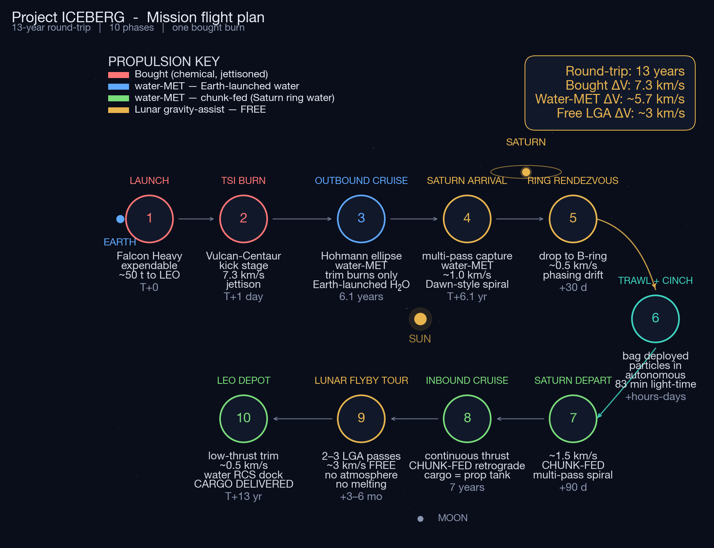
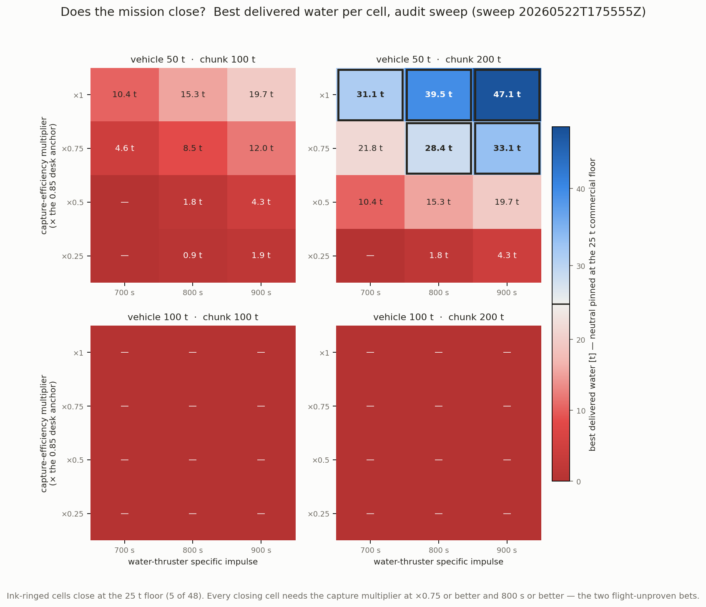
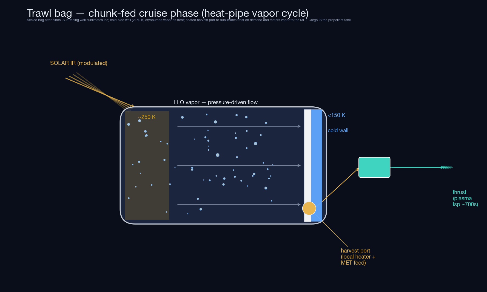
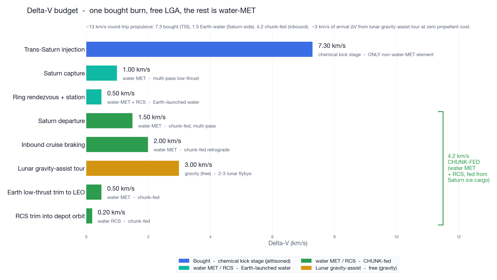

# Project ICEBERG

A mission-concept study: harvest multi-tonne water-ice chunks from Saturn's B ring and deliver them to Earth orbit as propellant feedstock. The chunk doubles as the return-leg propellant tank — the tug drinks its own cargo on the way home, feeding a water microwave-electrothermal thruster through a sublimation-capture trawl bag.

No hardware exists. No flight is booked. This is a paper study, and the study's own verdict is that the architecture stands or falls on three engineering bets nobody has yet won. That verdict — and the 183-round analysis campaign that produced it — is what this repository documents.



The full story — architecture, method, the graveyard of killed claims, and the three bets — is written up at [robotrocketscience.com/projects/iceberg](https://www.robotrocketscience.com/projects/iceberg/).

## The three bets

The full decision record lives in [`water-prop/docs/ARCHITECTURE-DECISION-MATRIX.md`](water-prop/docs/ARCHITECTURE-DECISION-MATRIX.md) and the per-axis files under [`design-axes/`](design-axes/). Reduced to its load-bearing assumptions, closure requires:

1. **Active chunk capture at scale.** The desk-study anchor assumes 85 percent single-pass capture efficiency. A bottoms-up engineering decomposition (rendezvous × deployment × catch × containment × survival) gives roughly 46 percent. The architecture collapses below about 75 percent of the anchor. Cassini sampled ring particles passively; nobody has actively captured a multi-tonne ring particle.
2. **Continuous water electrothermal propulsion at flight scale.** Ground tests confirm 800 seconds of specific impulse with water vapor — in 50-second pulses, on lab-clean water. The mission needs continuous operation for months on ring-sourced water. Closure is steeply sensitive: at a 30-tonne delivery floor, 0 percent of architectures close at 600 seconds, 4 percent at 800, 12 percent at 900.
3. **A kilowatt-class space fission reactor delivered in the program window.** The United States has flown exactly one fission reactor, in 1965, and every program since — six of them, roughly 1.7 billion dollars — was cancelled before orbit. The campaign treats reactor availability as a gated external dependency, and treats every megawatt-class closure row as upside-only, per a standing project directive.

Each bet maps to a specific demonstrator-mission objective, and each fails in a different way. The campaign's canonical sweep at a 25-tonne commercial delivery floor finds 5,656 feasible paths across 322 unique architectures, with a best single delivery of 39.5 tonnes in an 11.93-year round trip — every one of those paths conditional on the three bets above.



The three newest rounds ([R_chunk_despin_budget](water-prop/rounds/R_chunk_despin_budget/), [R_com_offset_thrust_alignment](water-prop/rounds/R_com_offset_thrust_alignment/), [R_harvest_draw_symmetrization](water-prop/rounds/R_harvest_draw_symmetrization/)) priced the spin question: de-spinning a captured chunk costs grams to kilograms at Cassini-anchored spin rates; the real cost is pushing a cargo whose center of mass walks 1.2 to 1.7 metres as it sublimates — mission-killing if fought with reaction control, a 2-percent cosine tax if steered through, and reducible to centimetres with a polar harvest port plus a once-a-day Apollo-style roll. An interactive version of the matrix above is at [robotrocketscience.com/projects/iceberg-matrix](https://www.robotrocketscience.com/projects/iceberg-matrix/).





## What's here

| Path | What it is |
|---|---|
| [`ICEBERG-conops.md`](ICEBERG-conops.md) | Working concept of operations. Full math, costed mission breakdown, trawl-bag engineering treatment, economics, risk. |
| [`ICEBERG-pitch.md`](ICEBERG-pitch.md) | Executive-summary discussion draft. Narrative entry point. |
| [`ICEBERG-demand.md`](ICEBERG-demand.md) | Bottoms-up demand build per buyer, alternative-cost stacks, willingness-to-pay curves, lunar-resource crossover model. |
| [`ICEBERG-bag-engineering.md`](ICEBERG-bag-engineering.md) | Trawl-bag companion: particle cull sizing, permeability aging, stationkeeping delta-v during fill. |
| [`saturn-water-isru-sketch.md`](saturn-water-isru-sketch.md) | The original back-of-envelope sketch the architecture evolved from. |
| [`REQUIREMENTS.md`](REQUIREMENTS.md) / [`REQUIREMENTS-L1.md`](REQUIREMENTS-L1.md) | Level-0 and Level-1 requirements with a variance log. |
| [`RISKS.md`](RISKS.md) | Risk register. |
| [`TRADE-end-of-mission-conops.md`](TRADE-end-of-mission-conops.md) | End-of-mission disposal trade study. |
| [`design-axes/`](design-axes/) | 22 architecture-decision-record files, one per design axis, with append-only history. |
| [`water-prop/`](water-prop/) | The analysis campaign: 183 rounds under `rounds/`, each with a pre-registered study document and a runnable `run.py`; reusable physics models under `src/waterprop/`; the Monte Carlo mission-graph framework under `sims/mission_graph/`. |
| [`plots/`](plots/), `*.py` at root | Concept-of-operations plots and the scripts that generate them. |

## Reproducing the analysis

The campaign code is Python, managed with [uv](https://docs.astral.sh/uv/):

```bash
cd water-prop
uv sync
uv run pytest tests/          # physics-model sanity tests
uv run python rounds/R_silicate_contamination/run.py   # or any other round
```

Root-level scripts (`saturn_isru_boe.py`, `saturn_rendezvous_sim.py`, `generate_conops_plots.py`) run with numpy, scipy, and matplotlib and regenerate the plots in `plots/`.

A few rounds' large sweep outputs (multi-megabyte JSON) are excluded from the repository; each regenerates from its round's `run.py`.

## Method

The campaign runs on a pre-registered protocol ([`water-prop/PROTOCOL.md`](water-prop/PROTOCOL.md)): each round states its hypotheses and falsification criteria in a SCOPE or STUDY document before the run, results land unedited, and retractions are recorded rather than erased — several headline claims in the decision matrix are explicitly marked RETRACTED by later audit rounds. The work was carried out by AI research agents (Claude) running in parallel orchestrated sessions, with human direction setting the questions, locking ground-truth findings, and killing assumptions that failed audit. Round documents attribute work to session codenames (titan, rhea, phoebe, and other Saturn moons).

## What's not here

Some round documents cite internal working files — a session log, a planning registry, a business-planning thread (`startup/`), and orchestration protocols. Those stay in the private working repository; the citations were left intact rather than rewritten, so the paper trail stays honest. This repository is a curated snapshot with fresh history, and the private working repository remains active.

MIT licensed.
